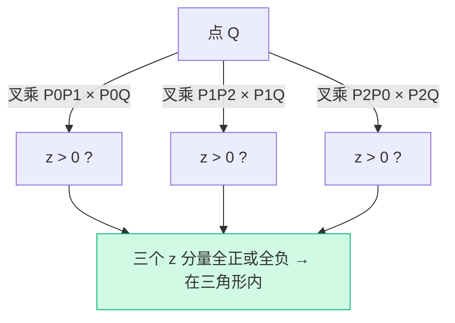

# GAMES101 现代计算机图形学入门 — Lecture 05 学习笔记

## 课程信息

- **课程名称**：GAMES101 现代计算机图形学入门
- **授课教师**：闫令琪（UCSB 助理教授）
- **本节课主题**：Rasterization — Triangles（光栅化——三角形）
- **阅读材料**：虎书《Fundamentals of Computer Graphics》第 8 章（The Graphics Pipeline）、第 3 章（Rasterization）
- **B站视频**：[Lecture 05 - Rasterization (Triangles)](https://www.bilibili.com/video/BV1X7411F744?p=5)

---

## 零、前情回顾：从 MVP 到屏幕

上一讲完成了 MVP 变换，把三维顶点从局部坐标系一路变换到了 NDC（$[-1,1]^3$）。本讲要回答的问题是：

> **NDC 里的三角形，怎么变成屏幕上的像素？**

这需要两步：
1. **视口变换（Viewport Transform）** ：NDC → 屏幕坐标
2. **光栅化（Rasterization）** ：判断屏幕上的哪些像素被三角形覆盖，并给它们着色

---

## 一、视口变换（Viewport Transform）

### 1.1 屏幕的定义

在图形学中，"屏幕"有明确的数学定义：

- 屏幕是一个由**像素（Pixel）** 组成的二维数组
- **分辨率** = 宽度 × 高度（如 1920 × 1080）
- 屏幕坐标系通常以**左下角为原点**，像素坐标 $(0,0)$ 到 $(width-1, height-1)$

> 📌 不同 API 的约定不同：OpenGL 原点在左下角，DirectX 和大多数窗口系统原点在左上角。但本质上只是 y 轴方向的区别。

### 1.2 从 NDC 到屏幕坐标

NDC 是 $[-1,1] \times [-1,1]$ 的二维平面（Z 分量暂时保留给深度测试），屏幕是 $[0, width] \times [0, height]$ 的像素网格。视口变换就是做一个**缩放 + 平移**：

$$
\mathbf{M}_{viewport} =
\begin{pmatrix}
\frac{width}{2}  & 0               & 0 & \frac{width}{2}  \\
0                & \frac{height}{2}& 0 & \frac{height}{2} \\
0                & 0               & 1 & 0                 \\
0                & 0               & 0 & 1
\end{pmatrix}
$$

展开：

$$
x_{screen} = \frac{width}{2}  \cdot x_{NDC} + \frac{width}{2}
$$

$$
y_{screen} = \frac{height}{2} \cdot y_{NDC} + \frac{height}{2}
$$

> 💡 直观理解：先将 $[-1,1]$ 的范围放大到屏幕尺寸，再把中心从 0 平移到屏幕中心。

---

## 二、为什么用三角形？

图形学中，三角形是所有图元的"原子单位"。无论是复杂的角色模型还是宏大的场景，最终都要**分解成三角形**交给 GPU 处理。三角形之所以成为标准图元，有以下几个原因：

### 2.1 三角形是最简单的多边形

- 三条边、三个顶点——无法再分解为更少的多边形
- 任何其他多边形都可以**三角剖分（Triangulation）** 为多个三角形

### 2.2 三角形保证是"平面的"

- 三个点必然共面（不共面的三点确定一个平面）
- 四边形、五边形的顶点可能不在同一平面上，会导致渲染瑕疵

### 2.3 三角形的内外定义明确

- 三角形将平面分割为内部和外部，不会有歧义
- 利用叉乘就能判断一个点在三角形内还是外（Lecture 02 的知识直接用上了）

### 2.4 三角形的属性插值简单

- 知道三个顶点的颜色、法线、纹理坐标，可以方便地通过**重心坐标（Barycentric Coordinates）** 插值出三角形内任意点的属性（下一讲详细展开）

---

## 三、光栅化的核心：采样（Sampling）

### 3.1 什么是采样？

光栅化本质上是一个**采样过程**：

> 给定屏幕上一个连续的三角形，判断哪些像素中心被这个三角形覆盖。如果覆盖，就将该像素着色。

用数学语言描述，就是把一个连续的 2D 函数（三角形覆盖区域）在离散的像素格点处采样：

$$
inside(triangle, x, y) =
\begin{cases}
1, & \text{像素中心 }(x+0.5, y+0.5)\text{ 在三角形内} \\
0, & \text{否则}
\end{cases}
$$

> 📌 像素中心在 $(x + 0.5, y + 0.5)$ 而不是 $(x, y)$——因为像素是一个小正方形，采样点取的是它的几何中心。

### 3.2 如何判断点是否在三角形内？

**用叉乘！** 这正是 Lecture 02 中叉乘知识的直接应用。

对于三角形 $\triangle P_0 P_1 P_2$ 和待判断的点 $Q$：

```cpp
// 三条边的叉乘
vec3 cross0 = cross(P1 - P0, Q  - P0);  // z > 0 → Q 在 P0P1 左侧
vec3 cross1 = cross(P2 - P1, Q  - P1);  // z > 0 → Q 在 P1P2 左侧
vec3 cross2 = cross(P0 - P2, Q  - P2);  // z > 0 → Q 在 P2P0 左侧

// 三个结果同号 → Q 在三角形内部
bool inside = (cross0.z > 0 && cross1.z > 0 && cross2.z > 0)
           || (cross0.z < 0 && cross1.z < 0 && cross2.z < 0);
```



---

## 四、遍历像素：包围盒优化

### 4.1 朴素方法：遍历整个屏幕

最简单的做法：遍历屏幕上的每一个像素，判断其中心是否在三角形内。但显然太浪费——对于只占屏幕 1% 的三角形，99% 的像素检查是徒劳的。

### 4.2 包围盒（Bounding Box）加速

**对于每个三角形，只检查其包围盒内的像素**：

$$
x_{min} = \min(x_0, x_1, x_2), \quad x_{max} = \max(x_0, x_1, x_2)
$$
$$
y_{min} = \min(y_0, y_1, y_2), \quad y_{max} = \max(y_0, y_1, y_2)
$$

```cpp
int x_min = max(0,            floor(min(x0, min(x1, x2))));
int x_max = min(width  - 1,   ceil(max(x0, max(x1, x2))));
int y_min = max(0,            floor(min(y0, min(y1, y2))));
int y_max = min(height - 1,   ceil(max(y0, max(y1, y2))));

for (int y = y_min; y <= y_max; y++) {
    for (int x = x_min; x <= x_max; x++) {
        if (insideTriangle(x + 0.5, y + 0.5)) {
            setPixel(x, y, color);
        }
    }
}
```

> 💡 `floor` 和 `ceil` 确保包围盒覆盖到所有可能被三角形触及的像素（保守估计），`max/min` 与屏幕边界钳制防止越界。

### 4.3 更进一步的优化：增量遍历

还可以按行扫描，先确定每行的起始和结束位置。但包围盒方法已经足够简单高效，大多数情况下的开销可接受。

---

## 五、光栅化的边界问题

### 5.1 共享边：一个像素属于哪个三角形？

当两个三角形共享一条边时，边上的像素应该由哪个三角形来着色？如果两个都着色（或不着色），就会产生**裂缝（Crack）** 或**重叠（Overlap）**。

> 这叫做**水密性（Water Tightness）** 问题——相邻三角形之间不能有缝隙。

### 5.2 常见的处理策略

**策略一：使用覆盖规则（Coverage Rules）**

OpenGL 和 DirectX 指定了"左上规则（Top-Left Rule）"——当像素中心恰好落在边上时：
- 如果是**左边界**或**上边界**（非右、非下），计为在三角形内
- 否则计为在三角形外

这保证了共享边只会被一个三角形认领。

**策略二：不处理，依赖后续**

在一些软件光栅化实现中，干脆不做特殊处理。只要叉乘判断函数的一致性足够好（浮点精度足够），共享边的判断结果在两个三角形中会相同。

---

## 六、光栅化的输出

光栅化的最终产物是一个**帧缓冲（Framebuffer）** ——一块和屏幕分辨率相同的内存区域。每个像素位置存储一个颜色值（RGB）。

此时的颜色是均匀的纯色，因为还没有进行光照和纹理计算——那是下一阶段**着色（Shading）** 要做的事。光栅化只负责回答一个问题："每个三角形覆盖了哪些像素？"

---

## 七、光栅化与现代 GPU 管线

本讲讲的是**软件光栅化**的思路，有助于理解原理。但实际上，现代 GPU 的光栅化远比这复杂和高效：

- **硬件光栅化器（Hardware Rasterizer）** 专门负责这项任务
- 它并行处理大量三角形，每个三角形的像素遍历也是并行的
- 使用**层级化 tiles** 等技术进一步加速

不过，**原理是一样的**——找到被三角形覆盖的像素。只是实现方式从 O(n²) 优化到了硬件并行。

---

## 八、个人总结与思考

第五讲是 GAMES101 进入光栅化核心的第一个"实战"章节。给我印象最深的几点：

1. **光栅化 = 采样**：这个视角非常重要。把一个连续函数（三角形覆盖）在离散格点上采样——理解了这一点，后续的反走样（Anti-aliasing）就好理解了。走样（Aliasing）就是采样不足导致的信号失真，反走样就是改进采样策略。

2. **叉乘贯穿始终**：Lecture 02 学的叉乘判断"点在三角形内"，在本讲直接成了光栅化的核心判断。线性代数的每一个知识点都有用武之地，这种感觉很踏实。

3. **包围盒是工程效率思维的体现**：遍历所有像素的 O(n²) 太蠢了，加几行代码就能把检查范围缩小到包围盒。这是"算法优化"在图形学中的生动案例。

4. **水密性问题看似微小，实则致命**：相邻三角形之间哪怕只有一个像素的裂缝，在渲染结果中都会非常刺眼。图形学里很多看似微小的"边界情况"，往往要花大量精力去处理。

5. **软件 vs 硬件光栅化**：理解软件光栅化的原理之后，GPU 硬件光栅化不再是"魔法黑盒"。原理相通——只是硬件做得更快、更并行。

下一讲将进入**反走样（Antialiasing）与深度测试（Z-buffer）** ——光栅化产出的"粗糙像素图"如何变得更平滑、更准确。🚀

---

## 🎬 课程视频

- **B站链接**：[Lecture 05 - Rasterization (Triangles)](https://www.bilibili.com/video/BV1X7411F744?p=5)

<iframe src="//player.bilibili.com/player.html?bvid=BV1X7411F744&p=5" 
        scrolling="no" 
        border="0" 
        frameborder="no" 
        framespacing="0" 
        allowfullscreen="true" 
        width="100%" 
        height="500">
</iframe>

---

**参考资料**：
- GAMES101 Lecture 05 课程视频
- 闫令琪老师课程课件
- 虎书《Fundamentals of Computer Graphics》第 3、8 章
