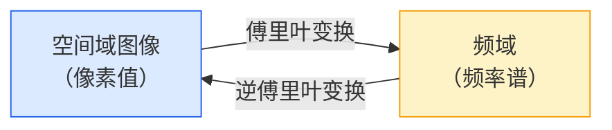
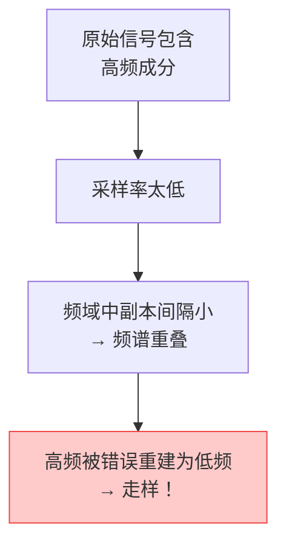
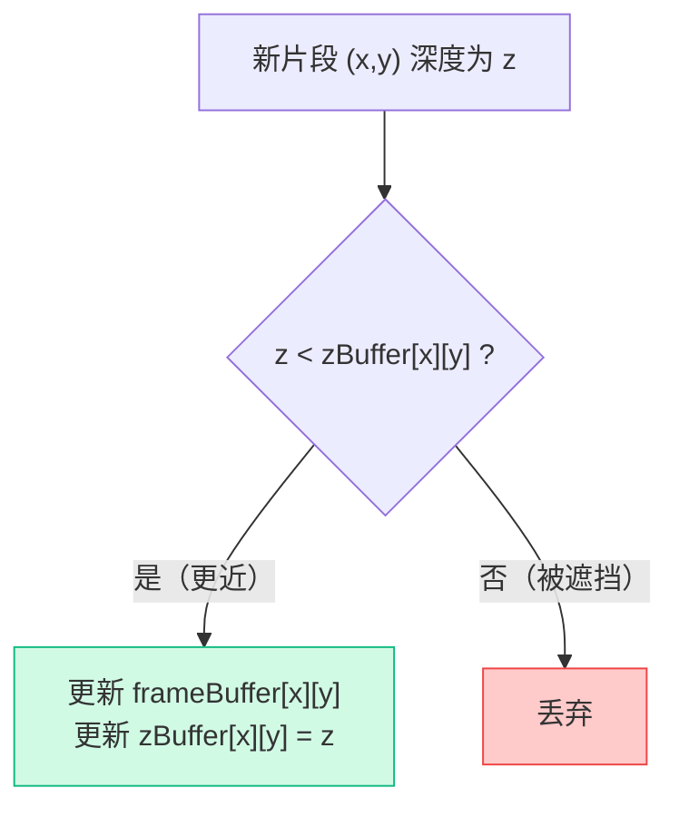
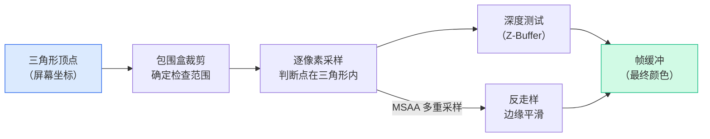

# GAMES101 现代计算机图形学入门 — Lecture 06 学习笔记

## 课程信息

- **课程名称**：GAMES101 现代计算机图形学入门
- **授课教师**：闫令琪（UCSB 助理教授）
- **本节课主题**：Rasterization 2 — Antialiasing and Z-Buffering（光栅化续——反走样与深度缓冲）
- **阅读材料**：虎书《Fundamentals of Computer Graphics》第 8 章（The Graphics Pipeline）、第 9 章（Signal Processing）
- **B站视频**：[Lecture 06 - Rasterization (Antialiasing and Z-Buffering)](https://www.bilibili.com/video/BV1X7411F744?p=6)

---

## 零、前情回顾：光栅化之后的问题

上一讲完成了光栅化的第一步——把三角形变成屏幕上的像素。但这个过程留下了两个亟待解决的问题：

1. **锯齿（Jaggies）** ：三角形边缘的像素要么被完全覆盖、要么完全不被覆盖，导致边缘呈阶梯状
2. **遮挡（Occlusion）** ：多个三角形在屏幕上重叠时，谁能被看到？谁应该被挡住？

本讲要回答的正是这两个问题——**反走样（Antialiasing）** 和 **深度测试（Z-Buffering）**。

---

## 一、走样（Aliasing）——光栅化的"原罪"

### 1.1 什么是走样？

光栅化本质上是一个**采样过程**——在离散的像素格点上对一个连续的"三角形覆盖函数"进行采样。而**走样（Aliasing）** 就是采样不足导致的信号失真。

> 📌 "Aliasing" 这个名字来自信号处理领域：高频信号在被低速采样后，会"伪装"成低频信号——就像间谍使用"别名（Alias）"一样。

### 1.2 图形学中常见的走样现象

| 走样类型 | 采样域 | 现象 |
|---------|--------|------|
| **锯齿（Jaggies）** | 空间 | 三角形边缘呈现阶梯状 |
| **摩尔纹（Moiré Pattern）** | 空间（图像） | 对规律纹理采样不足产生的条纹 |
| **车轮效应（Wagon Wheel Illusion）** | 时间 | 车轮看起来在倒转（帧率跟不上转速） |

> 💡 这三个现象的**本质相同**——信号变化太快，但采样太慢。理解了这一点，你就抓住了反走样的核心。

### 1.3 走样的根本原因

用一句话概括：

> 🔑 **采样率跟不上信号的最高频率。**

- 信号本身包含丰富的高频信息（如尖锐的边缘）
- 采样点的间距过大（分辨率不够），无法捕捉这些快速变化
- 高频信号被错误地重建为低频信号 → 看起来"不像原来的东西"了

---

## 二、反走样的理论基础——频域分析

要真正理解反走样为什么有效，需要进入**频域（Frequency Domain）** 看问题。这是本节课理论最深的部分，也是后续所有反走样方法的根基。

### 2.1 傅里叶变换：从空间域到频域

**傅里叶变换（Fourier Transform）** 告诉我们：任何信号都可以分解为**不同频率的正弦波之和**。

- **空间域（Spatial Domain）**：我们日常看到的图像，像素排列
- **频域（Frequency Domain）**：图像中各种频率成分的分布

图像的边缘（像素值剧烈变化的地方）对应**高频**，平滑区域（像素值变化缓慢）对应**低频**。



### 2.2 滤波（Filtering）= 卷积（Convolution）= 平均

**滤波**就是把信号中的某些频率成分去掉或保留：

- **高通滤波（High-Pass Filter）**：去掉低频，保留高频 → 提取**边界**（图像变锐利）
- **低通滤波（Low-Pass Filter）**：去掉高频，保留低频 → 图像变**模糊**（这正是反走样需要的！）

数学上，滤波是通过**卷积（Convolution）** 实现的——用滤波器窗口在信号上滑动，每个位置计算加权平均。最简单的低通滤波器就是**盒式滤波器（Box Filter）** ——在窗口内取算术平均。

> 📌 **卷积定理（Convolution Theorem）**：空间域的卷积 = 频域的乘法。这个定理是理解反走样的关键——在空间域"模糊"就是在频域"砍掉高频"。

### 2.3 采样 = 频域中的内容复制

采样过程在频域中对应一个惊人的操作：**将信号的频谱在频域中重复（Replicate）**。

采样点越密集（采样率越高），复制出的频谱副本之间间隔越大；采样点越稀疏（采样率越低），副本之间间隔越小。

### 2.4 走样的频域解释——频谱混叠

当采样率过低时，频谱副本之间发生**重叠（Overlap）**——这就是走样：



> 🔑 **反走样的频域解释**：先做低通滤波（砍掉高频），让频谱"变窄"，再以同样的低采样率采样——频谱不重叠 → 不走样。

---

## 三、反走样的实践方法

### 3.1 核心原则：先模糊，再采样

**顺序至关重要！**

- ✅ **先模糊 → 再采样** = 正确的反走样（高频已经被滤掉了）
- ❌ **先采样 → 再模糊** = 模糊的走样（走样已经发生，模糊只是掩盖而已）

| 方案 | 操作 | 代价 |
|------|------|------|
| 方案一：提高采样率 | 用更高分辨率渲染 | 硬件成本高、计算量大 |
| 方案二：反走样 | 先低通滤波（模糊）再采样 | 计算开销、算法复杂度 |

> 💡 方案一治本，方案二治标但实用。工业界通常结合使用——在有限分辨率下做反走样，性价比最高。

### 3.2 三角形光栅化中的反走样

对于光栅化而言，像素颜色应该等于**三角形覆盖该像素的面积比例**：

$$I(x, y) = \frac{\text{三角形覆盖像素 }(x,y)\text{ 的面积}}{\text{像素总面积}} \times \text{三角形颜色}$$

边缘像素获得中间色（例如浅红色），而不是非黑即白的纯红色——边缘变得平滑。

> 📌 这等价于：对图像做 **1 像素宽的盒式低通滤波**，再在每个像素中心点采样。

### 3.3 MSAA（Multi-Sample Anti-Aliasing）——多重采样反走样

直接计算三角形覆盖像素的精确面积很难（涉及多边形裁剪和积分）。MSAA 是一种**近似**——在每个像素内取多个采样点，统计有多少点落在三角形内。

**MSAA 的执行流程**：

> 对于每个像素：
> 1. 在像素内取 N×N 个子采样点（例如 2×2 = 4 个点）
> 2. 对每个子采样点做"是否在三角形内"的判断
> 3. 统计"在内部"的子采样点数量 k
> 4. 像素颜色 = 三角形颜色 × (k / N²)

**举例**：2×2 MSAA 中，如果 4 个子采样点有 3 个在三角形内，则该像素颜色为 $0.75 \times$ 三角形颜色。

> ┌─────────┐
> │ ●   ●   │   ● = 子采样点在三角形内（3个）
> │         │   ○ = 子采样点在三角形外（1个）
> │   ●   ● │
> │         │   像素颜色 = 三角形颜色 × 3/4
> └─────────┘

> ⚠️ **MSAA ≠ 提高分辨率**。MSAA 只对三角形覆盖的"面积比例"做更精确的近似，并**不增加着色计算的分辨率**——每个像素仍然只做一次着色（Fragment Shader 只跑一次）。这是它区别于 SSAA（Super-Sample Anti-Aliasing，每个子采样点都做着色）的关键所在，也是它性价比高于 SSAA 的原因。

**MSAA 的代价**：
- 子采样判断增加了计算量，但不成倍增加（得益于优化采样模式）
- 工业界使用**不规则采样点分布**，且相邻像素可能**复用子采样点**，进一步降低成本

### 3.4 工业界其他反走样方案

| 技术 | 类型 | 原理 | 特点 |
|------|------|------|------|
| **SSAA** | 超采样 | 以更高分辨率渲染后缩放 | 效果好但代价极大，现已少用 |
| **MSAA** | 超采样 | 仅对覆盖信息多重采样 | 硬件支持广泛，性价比好 |
| **FXAA** | 图像后处理 | 检测锯齿边缘 → 替换为平滑边界 | 速度极快，无需额外采样；但画面略模糊 |
| **TAA** | 时域复用 | 将 MSAA 采样点分散到不同帧，帧间复用 | 静态场景效果极好，开销小；动态场景可能出现鬼影 |
| **DLSS** | 深度学习 | 用神经网络从低分辨率重建高分辨率 | NVIDIA RTX 独占；能同时提升"分辨率"和"反走样"效果 |

> 💡 每种方案都有其适用场景。实时游戏通常优先 FXAA 或 TAA（快），画面优先的应用倾向于 MSAA 或 DLSS（好）。不存在"最好"的方案，只有"最合适"的方案。

---

## 四、深度缓冲（Z-Buffer）——解决可见性问题

### 4.1 可见性问题（Visibility Problem）

场景中有多个三角形，它们投影到屏幕上后会互相遮挡。渲染时必须判断：每个像素由哪个三角形来着色？

这被称为**可见性问题**或**遮挡剔除问题**。

### 4.2 画家算法（Painter's Algorithm）及其缺陷

最直观的想法——像画油画一样从远到近画：

1. 将所有三角形按深度（距离相机的远近）排序
2. 从最远的三角形开始渲染，依次覆盖帧缓冲

**时间复杂度**：$O(n \log n)$（排序开销）

**致命缺陷**：**无法处理循环遮挡！**

> 情景：三个三角形相互遮挡
>   A 部分遮挡 B
>   B 部分遮挡 C
>   C 部分遮挡 A
> → 无法确定唯一的深度顺序
> → 画家算法失败！

> 💡 这种循环遮挡在复杂场景中并不罕见。画家算法在早期图形学（如 OpenGL 1.0 时代）曾被使用，但很快被 Z-Buffer 取代。

### 4.3 Z-Buffer 算法

**核心思想**：既然排序解决不了，就不排序——改为**逐像素记录当前可见的最小深度**。

**数据结构**：
- **帧缓冲（Frame Buffer）**：存储每个像素的**颜色值**（RGB）
- **深度缓冲（Z-Buffer / Depth Buffer）**：存储每个像素的**最小深度值**（浮点数）

**算法流程**：

```cpp
// 初始化：所有像素深度设为无穷大
float zBuffer[width][height];
for (int y = 0; y < height; y++)
    for (int x = 0; x < width; x++)
        zBuffer[x][y] = INFINITY;  // 无穷远

// 光栅化每个三角形
for (Triangle &tri : triangles) {
    for (int y = y_min; y <= y_max; y++) {
        for (int x = x_min; x <= x_max; x++) {
            if (insideTriangle(x + 0.5, y + 0.5)) {
                float z = interpolateDepth(x, y, tri);  // 像素中心在三
                //                                角形内的深度
                if (z < zBuffer[x][y]) {        // 当前三角形更近
                    zBuffer[x][y] = z;           // 更新深度
                    frameBuffer[x][y] = tri.color; // 更新颜色
                }
                // 否则：什么都不做（有更近的东西挡着）
            }
        }
    }
}
```



### 4.4 Z-Buffer 的性质

| 性质 | 说明 |
|------|------|
| **时间复杂度** | $O(n)$，$n$ 为三角形数量（无需排序！） |
| **顺序无关** | 结果与三角形处理顺序无关，总是保留最近的面 |
| **处理循环遮挡** | ✅ 能正确处理（逐像素比较，逐个判定） |
| **硬件实现** | 所有现代 GPU 都硬件实现了 Z-Buffer |
| **局限性** | 不能处理**透明物体**（透明物体需要看到它后面的颜色） |

> 💡 透明物体的处理需要额外的技术（如 Alpha Blending、Order-Independent Transparency），这是更进阶的话题。

### 4.5 Z-Buffer 的深度值分布

回顾 Lecture 04，透视投影后 Z 值呈**非线性分布**——近处精度高，远处精度低。这直接影响到 Z-Buffer 的精度。

> 离相机近 → Z 精度高 → 两个面容易区分
> 离相机远 → Z 精度低 → 可能出现 Z-Fighting（两个面交替"胜出"产生闪烁）

> 📌 实践中，Z-Buffer 通常使用 **24 位或 32 位** 精度存储。在 OpenGL 中通过 `glEnable(GL_DEPTH_TEST)` 开启深度测试。

---

## 五、光栅化阶段小结

至此，整个光栅化管线（从三角形到带深度的像素）已经完整：



---

## 六、个人总结与思考

第六讲是 GAMES101 中"理解深度"非常深的一堂课。看起来只讲了两件事——反走样和深度测试，但背后的理论体系非常扎实。

1. **频域思维是图形学的"内功"**：闫老师在课上花了大量时间讲傅里叶变换、频域、卷积定理。这些内容看似"理论"，但它们是理解所有采样问题的基础。走样为什么发生？为什么先模糊再采样就能解决？在频域里就是一句话——缩小频谱防止混叠。有了这个内功，后续的纹理走样、阴影走样甚至时域走样（TAA）都一通百通。

2. **先模糊再采样 vs 先采样再模糊**：这个顺序问题是本节课最容易被忽略但最关键的细节。采样是一个"不可逆"的操作——一旦走样发生，后续再模糊也无济于事（高频已经伪装成低频了）。这让我联想到工程中很多类似的情况——问题一旦被引入就很难修复，所以要在正确的阶段做正确的处理。

3. **MSAA 的"近似"思维**：精确计算三角形覆盖面积很难，但用多个采样点去近似它很简单。这种"用采样近似积分"的思想在图形学中反复出现（蒙特卡洛、光线追踪、环境光遮蔽……）。MSAA 是一个经典的工程折中：效果好于不做反走样，代价远低于 SSAA。

4. **Z-Buffer 的 O(n) 之美**：Painter's Algorithm 需要 O(n log n) 排序，遇到循环遮挡直接崩溃。Z-Buffer 用 O(n) 的额外空间换来了 O(n) 的时间复杂度和完美的正确性——这种"空间换时间"的设计在计算机科学中屡见不鲜。而且它极其简单——一个 `if (z < zbuffer[x][y])` 就是全部逻辑。历史上 Z-Buffer 被提出时，内存还很昂贵，但它用优雅的设计赢得了未来。

5. **理论的层次感**：本讲从现象（锯齿）→ 原理（频域分析）→ 实践（MSAA）→ 边界（Z-Buffer局限性），层层递进。理解每一层都是值得的——可以只记住 MSAA 怎么用，但理解频域才能理解为什么要这么做、什么情况下 MSAA 失效、以及该如何设计更好的方案。

下一讲将进入**着色（Shading）**——Blinn-Phong 反射模型、着色频率和渲染管线。光栅化回答了"哪些像素被覆盖"和"谁能被看到"，着色则要回答"每个像素应该是什么颜色"。🎨

---

## 🎬 课程视频

- **B站链接**：[Lecture 06 - Rasterization 2 (Antialiasing and Z-Buffering)](https://www.bilibili.com/video/BV1X7411F744?p=6)

<iframe src="//player.bilibili.com/player.html?bvid=BV1X7411F744&p=6" 
        scrolling="no" 
        border="0" 
        frameborder="no" 
        framespacing="0" 
        allowfullscreen="true" 
        width="100%" 
        height="500">
</iframe>

---

**参考资料**：
- GAMES101 Lecture 06 课程视频
- 闫令琪老师课程课件
- 虎书《Fundamentals of Computer Graphics》第 8、9 章
