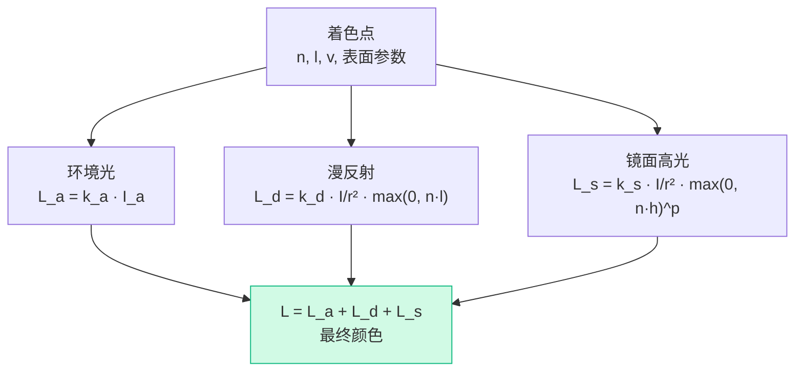
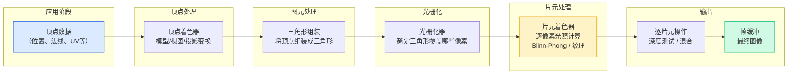

# GAMES101 现代计算机图形学入门 — Lecture 07 学习笔记

## 课程信息

- **课程名称**：GAMES101 现代计算机图形学入门
- **授课教师**：闫令琪（UCSB 助理教授）
- **本节课主题**：Shading 1 — Illumination, Shading and Graphics Pipeline（着色——光照、着色与图形管线）
- **B站视频**：[Lecture 07 - Shading (Illumination, Shading and Graphics Pipeline)](https://www.bilibili.com/video/BV1X7411F744?p=7)

---

## 零、前情回顾：从光栅化到着色

前六讲完成了整条管线的"几何"部分：

> 模型变换 → 视图变换 → 投影变换 → 光栅化（哪些像素被覆盖？）→ 深度测试（谁能被看到？）

现在所有三角形已经正确投影到屏幕上，每个像素也知道由哪个三角形负责。**接下来的问题是**：每个像素应该是什么颜色？

这就是**着色（Shading）** 要回答的问题。

> 📌 本讲中 Z-Buffer 部分已在 Lecture 06 笔记中完整覆盖（画家算法、Z-Buffer 算法流程、O(n) 复杂度分析），此处不再重复。本讲聚焦于**着色**。

---

## 一、着色是什么？

### 1.1 定义

> 🔑 **着色（Shading）**：将材质（Material）应用到物体上的过程。

在 Merriam-Webster 词典中，"shading" 指"用平行线或色块对插图进行暗化或上色"。在图形学中，着色就是计算每个像素应该呈现什么颜色——基于物体的材质、光源的属性和观察者的位置。

### 1.2 着色 ≠ 阴影

**着色是局部的（Local）**——只考虑当前着色点、光源和相机的关系，不考虑其他物体的遮挡。这意味着：

- Blinn-Phong 模型**不会自动生成阴影**
- 阴影（Shadow）需要额外的技术来处理（Shadow Mapping 等）

> 💡 可以这样理解：着色回答"这个表面在光照下看起来是什么颜色"，而阴影回答"光能不能照到这个表面"。

---

## 二、Blinn-Phong 反射模型

Blinn-Phong 是一个**经验模型（Empirical Model）**——它不追求物理上的精确，而是用一个简单有效的公式来**近似**真实世界的光照效果。物理准确的模型将在后续的光线追踪（Path Tracing）部分介绍。

### 2.1 感知观察

观察真实世界的光照，可以发现三个现象：

| 分量 | 现象 | 示例 |
|------|------|------|
| **镜面高光（Specular Highlights）** | 光滑表面上的亮斑 | 苹果上的白色反光点 |
| **漫反射（Diffuse Reflection）** | 光线被粗糙表面均匀散射 | 桌面的均匀颜色 |
| **环境光（Ambient Lighting）** | 即使背光面也不是全黑的微弱亮度 | 物体背面的微弱细节 |

Blinn-Phong 模型的策略是：**分别计算这三个分量，再加起来**。

### 2.2 着色计算的输入

在表面上取一个**着色点（Shading Point）**，计算该点反射到相机的光：

>          n (法线)
>          ↑
>          │
>     l    │    v (观察方向)
>     ←────●────→
>    (光源)  (相机)

| 符号 | 含义 | 说明 |
|------|------|------|
| **n** | 表面法线（Normal） | 垂直于表面的单位向量 |
| **l** | 光源方向（Light） | 着色点指向光源的单位向量 |
| **v** | 观察方向（View） | 着色点指向相机的单位向量 |
| 表面参数 | 颜色、光泽度等 | 决定材质的外观 |

这些计算在**世界坐标系**中进行（光照计算需要在同一个空间下）。

---

## 三、漫反射（Diffuse Reflection）

### 3.1 物理直觉

当光线照射到粗糙表面时，光被**向各个方向均匀散射**。因此：

> 🔑 **漫反射的亮度与观察方向 v 无关**——无论你从哪个角度看，表面颜色都一样。

### 3.2 Lambert 余弦定律

问题是：表面能**接收**多少光能量？

>   光线垂直照射                光线以 60° 角照射
>   ┃┃┃┃┃                      ﹨ ﹨ ﹨
>   ┃┃┃┃┃                        ﹨ ﹨ ﹨
>   ↓↓↓↓↓                          ﹨  ﹨  ﹨
>   ┌────────┐                  ┌────────┐
>   │ 表面   │                  │ 表面   │ ← 只有一半光能量！
>   └────────┘                  └────────┘

> 📌 **Lambert 余弦定律**：单位面积接收的光能量正比于 $\cos \theta = \mathbf{n} \cdot \mathbf{l}$

- $\mathbf{n} \cdot \mathbf{l} = 1$：光垂直入射，接收全部能量
- $\mathbf{n} \cdot \mathbf{l} = 0.5$：光以 60° 角入射，接收一半能量
- $\mathbf{n} \cdot \mathbf{l} \leq 0$：光从背面射来（无物理意义，钳制为 0）

### 3.3 光的距离衰减

点光源发出的能量均匀分布在一个不断扩大的球壳上。球壳面积 = $4\pi r^2$，因此：

> 📌 **光的强度与距离平方成反比**：距离为 $r$ 处接收到的光强 = $I / r^2$

这解释了为什么越远的物体越暗。

### 3.4 漫反射公式

$$L_d = k_d \cdot \frac{I}{r^2} \cdot \max(0, \mathbf{n} \cdot \mathbf{l})$$

| 符号 | 含义 | 取值范围 |
|------|------|---------|
| $L_d$ | 漫反射光 | RGB 颜色 |
| $k_d$ | 漫反射系数（物体固有色） | RGB，0（全吸收/黑）到 1（全反射） |
| $I$ | 光源强度 | 标量或 RGB |
| $r$ | 光源到着色点的距离 | $>0$ |
| $\max(0, \mathbf{n} \cdot \mathbf{l})$ | 余弦衰减（钳制到非负） | $[0, 1]$ |

> 💡 $k_d$ 就是物体的"固有色"。红光照射白色物体 → 红色；白光照射红色物体 → 红色（只有红色分量被反射）。


---

## 四、镜面高光（Specular Highlights）

### 4.1 物理直觉

当表面比较光滑时，入射光会在**镜面反射方向**附近形成一个亮斑。与漫反射不同：

> 🔑 **镜面高光的亮度取决于观察方向 v**——当 v 接近镜面反射方向时高光亮，偏离时高光暗。

### 4.2 Phong 模型 vs Blinn-Phong 模型

**Phong 模型**的思路：计算反射向量 $\mathbf{R}$，看 $\mathbf{v}$ 离 $\mathbf{R}$ 有多近 → $\cos \alpha = \mathbf{v} \cdot \mathbf{R}$

但计算反射向量 $\mathbf{R}$ 有开销。**Blinn-Phong 的改进**——引入**半程向量（Half-Angle Vector）**：

>          n
>          ↑   h (半程向量: l和v的角平分线)
>     l    │  ↗
>     ←────●────→ v

$$\mathbf{h} = \frac{\mathbf{v} + \mathbf{l}}{\|\mathbf{v} + \mathbf{l}\|} \quad \text{（单位化后的半程向量）}$$

然后用 $\mathbf{n} \cdot \mathbf{h}$ 来近似 $\mathbf{v} \cdot \mathbf{R}$：

> 📌 当 $\mathbf{h}$ 接近 $\mathbf{n}$ 时，说明 $\mathbf{v}$ 接近镜面反射方向 → 产生高光。

**Blinn-Phong 相比 Phong 的优势**：
- 半程向量计算简单（只需向量加法 + 归一化）
- 能量更保守、高光更自然

### 4.3 镜面高光公式

$$L_s = k_s \cdot \frac{I}{r^2} \cdot \max(0, \mathbf{n} \cdot \mathbf{h})^p$$

| 符号 | 含义 | 说明 |
|------|------|------|
| $L_s$ | 镜面高光 | RGB 颜色 |
| $k_s$ | 镜面反射系数 | 通常为白色（高光通常是光源颜色） |
| $p$ | **光泽度指数（Shininess）** | 控制高光范围大小 |

### 4.4 光泽度指数 p 的作用

$\mathbf{n} \cdot \mathbf{h}$ 本身随角度变化很"平缓"（cos 函数在 0° 附近下降慢）。**取 p 次幂后，只有 $\mathbf{n}$ 和 $\mathbf{h}$ 非常接近时值才大**：

> p = 1:   ▁▂▃▄▅▆▇██▇▆▅▄▃▂▁  (高光范围很大，像塑料)
> p = 10:  ▁▁▁▂▃▄▅▆▇█▇▆▅▄▃▂▁▁▁  (高光范围适中)
> p = 100: ▁▁▁▁▁▁▁▂▄▇█▇▄▂▁▁▁▁▁▁▁  (高光范围很小，像金属)
> p = 200: ▁▁▁▁▁▁▁▁▁▂▅█▅▂▁▁▁▁▁▁▁▁▁  (极亮的小点)

- $p$ 小（如 1-10）：高光扩散，像**橡胶/塑料**
- $p$ 大（如 100-200+）：高光集中，像**抛光金属**

> 💡 在 Blinn-Phong 模型中，$p$ 通常在 100-200 左右，这也是区别它与 Phong 模型的一个特征。

---

## 五、环境光（Ambient Lighting）

### 5.1 问题

在真实世界中，即使背对光源的表面也**不是全黑的**——光线经过多次反弹（墙壁、地板、天花板），最终还是会照亮暗面。

计算这些间接光照非常复杂（需要**全局光照/Global Illumination**）。Blinn-Phong 用一个**极其简化的近似**：

$$L_a = k_a \cdot I_a$$

| 符号 | 含义 |
|------|------|
| $L_a$ | 环境光分量 |
| $k_a$ | 环境光系数（通常等于 $k_d$，即物体固有色） |
| $I_a$ | 环境光强度（场景中的"基础亮度"） |

> 📌 环境光是一个**常数**——不依赖 $\mathbf{n}$、$\mathbf{l}$、$\mathbf{v}$，只是一个"兜底亮度"，确保没有像素是完全黑的。

---

## 六、完整的 Blinn-Phong 模型

将三个分量相加：

$$L = L_a + L_d + L_s$$

$$\boxed{L = k_a I_a + k_d \cdot \frac{I}{r^2} \cdot \max(0, \mathbf{n} \cdot \mathbf{l}) + k_s \cdot \frac{I}{r^2} \cdot \max(0, \mathbf{n} \cdot \mathbf{h})^p}$$



> ⚠️ Blinn-Phong 是**经验模型**，它有以下简化：
> - 不考虑表面到相机之间的能量衰减
> - 环境光是所有间接光照的粗暴近似
> - 镜面反射忽略了能量吸收
> - 这些简化是为了**速度**，不是物理正确性

---

## 七、着色频率（Shading Frequencies）

着色计算可以在不同粒度上进行，这带来了效果与性能之间的权衡。

### 7.1 三种着色频率

| 方法 | 着色计算在... | 法线来源 | 效果 |
|------|------------|---------|------|
| **Flat Shading（平面着色）** | 每个三角形面 | 面法线（两条边的叉积） | 棱角分明，能明显看到三角形面 |
| **Gouraud Shading（高洛德着色）** | 每个顶点 → 三角形内插值 | 顶点法线（相邻面法线的加权平均） | 较平滑，高光可能丢失 |
| **Phong Shading（Phong 着色）** | 每个像素/片段 | 逐像素插值顶点法线 | 最平滑，高光保留最好 |

> 📌 **术语提醒**："Phong Shading"（着色频率——逐像素着色）≠ "Phong/Blinn-Phong 反射模型"（光照公式）。两者都用了 Phong 的名字，但是不同的概念。

### 7.2 视觉效果与权衡

> Flat Shading:         Gouraud Shading:       Phong Shading:
>  ┌──┬──┬──┐           ╭───╮───╮───╮          ~~~~平滑曲面~~~~
>  │A │B │C │           │   A   B  C │         (每个像素独立计算)
>  │  │  │  │           │            │
>  └──┴──┴──┘           ╰────────────╯
>  每个面色块不同        顶点着色后插值          高光保留最好

- **Flat Shading**：每个三角形面一个恒定颜色，面与面之间有明显的颜色跳变
- **Gouraud Shading**：在顶点计算颜色，三角形内部用重心坐标插值。问题：高光如果在三角形中间（不在顶点上）会**丢失**
- **Phong Shading**：先逐像素插值法线，再逐像素计算光照。对每个像素都完整跑一遍 Blinn-Phong 公式。效果好，但计算量大

### 7.3 一个重要洞察

> 💡 当模型足够精细（三角形尺寸小于一个像素）时，Flat Shading 的效果也可以非常好！因为此时每个三角形覆盖不到一个像素，逐面着色就等价于逐像素着色。

这就是为什么**高面数模型 + 简单着色**可以和**低面数模型 + 复杂着色**获得相似的视觉效果——计算资源的分配本质上是一种权衡。

### 7.4 顶点法线的计算

对于**顶点法线**（Gouraud 和 Phong Shading 都需要），通常取相邻面法线的**面积加权平均**：

$$\mathbf{n}_{vertex} = \frac{\sum_i A_i \cdot \mathbf{n}_{face\_i}}{\|\sum_i A_i \cdot \mathbf{n}_{face\_i}\|}$$

其中 $A_i$ 是相邻面的面积，$\mathbf{n}_{face\_i}$ 是面的法线。**用面积加权**是因为大面积面对顶点法线的影响通常更大。

---

## 八、图形实时渲染管线

将目前学过的所有内容串联起来，就是**图形渲染管线（Graphics Pipeline）** ——从输入到输出的一整套流程：



### 8.1 各阶段说明

| 阶段 | 输入 | 做什么 | 输出 | 可编程？ |
|------|------|--------|------|---------|
| **顶点处理（Vertex Processing）** | 顶点属性 | MVP 变换、顶点着色 | 屏幕空间顶点 | ✅ Vertex Shader |
| **图元组装（Primitive Assembly）** | 屏幕空间顶点 | 将顶点连接成三角形 | 三角形图元 | ❌ 固定功能 |
| **光栅化（Rasterization）** | 三角形图元 | 采样覆盖、生成片元 | 片元（Fragments） | ❌ 固定功能 |
| **片元处理（Fragment Processing）** | 片元 | 计算颜色（光照/纹理） | 带颜色的片元 | ✅ Fragment Shader |
| **逐片元操作（Per-Fragment Ops）** | 片元 | 深度测试、混合 | 像素颜色 | ⚠️ 可配置 |

### 8.2 Shader 编程

**Shader（着色器）** 是运行在 GPU 上的小程序，每个顶点/像素**并行执行**：

```glsl
// GLSL 示例：简单的 Fragment Shader
uniform sampler2D myTexture;      // 纹理（后续课程）
uniform vec3 lightDir;            // 光源方向（世界空间）
uniform vec3 lightColor;          // 光源颜色
uniform float specularPower;      // 光泽度指数

varying vec3 worldNormal;         // 从 Vertex Shader 插值来的法线
varying vec3 worldPosition;       // 从 Vertex Shader 插值来的位置

void main() {
    vec3 n = normalize(worldNormal);
    vec3 l = normalize(lightDir);
    vec3 v = normalize(-worldPosition); // 看向原点（相机在原点）

    // Ambient
    vec3 ambient = 0.1 * vec3(1.0, 1.0, 1.0);

    // Diffuse
    float diff = max(0.0, dot(n, l));
    vec3 diffuse = diff * lightColor;

    // Specular (Blinn-Phong)
    vec3 h = normalize(v + l);
    float spec = pow(max(0.0, dot(n, h)), specularPower);
    vec3 specular = spec * lightColor;

    gl_FragColor = vec4(ambient + diffuse + specular, 1.0);
}
```

> 💡 推荐练习：在 [Shadertoy](https://www.shadertoy.com) 上用 GLSL 实现 Blinn-Phong 模型，直观感受各参数的效果。

### 8.3 GPU 并行化的核心思想

管线的关键设计哲学：**同一个操作对不同数据并行执行**。

- Vertex Shader 对每个顶点并行执行
- Fragment Shader 对每个片元并行执行
- 每个 GPU 核心独立处理自己的数据，不等待其他核心

> 📌 这就是为什么图形渲染能在毫秒级别完成——不是串行处理几百万个像素，而是**同时**处理它们。

---

## 九、个人总结与思考

第七讲是从几何走向光照明暗的分水岭。

1. **"着色"这个词容易误导初学者**。在图形学中，"shading" 专指"计算颜色"，不包含"画阴影"（shadow）。我花了一些时间才适应这个术语差异。

2. **Blinn-Phong 的三个分量：从直觉到公式的映射很优雅**。漫反射用 n·l 衡量"接了多少光"（Lambert 定律），镜面高光用 n·h 衡量"v 是否在反射方向附近"（半程向量技巧），环境光直接用一个常数兜底。三个分量各司其职，公式简洁，效果却足够真实——这就是工程中"够用就好"的智慧。

3. **半程向量（Half-Angle Vector）是一个聪明但容易被忽视的 trick**。用 h 替代反射向量 R，把"v 是否接近 R"的问题转换成了"h 是否接近 n"的问题——计算量大幅降低。这种"换一个等价问题"的思路在算法设计中经常出现。

4. **着色频率的选择是典型的"质量 vs 性能"权衡**：Flat（快、粗糙）→ Gouraud（折中）→ Phong（好、慢）。高面数模型可以"降级"着色频率，低面数模型需要"升级"着色频率——计算预算的分配取决于场景的瓶颈在哪里。这个权衡在图形学中反复出现（纹理分辨率、LOD、阴影精度……）。

5. **Graphics Pipeline 是之前所有知识的串联**：MVP 变换 → 光栅化 → 着色 → 深度测试。理解了这条管线，就理解了实时渲染的核心骨架。后续的纹理映射、阴影、延迟渲染等，本质上都是在这条管线的不同阶段注入新的计算。

下一讲将深入**着色（Shading 2）**——镜面高光的更深入理解、着色频率的更多细节，以及管线的更完整视角。

---

## 🎬 课程视频

- **B站链接**：[Lecture 07 - Shading (Illumination, Shading and Graphics Pipeline)](https://www.bilibili.com/video/BV1X7411F744?p=7)

<iframe src="//player.bilibili.com/player.html?bvid=BV1X7411F744&p=7"
        scrolling="no"
        border="0"
        frameborder="no"
        framespacing="0"
        allowfullscreen="true"
        width="100%"
        height="500">
</iframe>

---

**参考资料**：
- GAMES101 Lecture 07 课程视频及课件
- 闫令琪老师课程网站 http://www.cs.ucsb.edu/~lingqi/teaching/games101.html
- Blinn-Phong 反射模型原始论文
