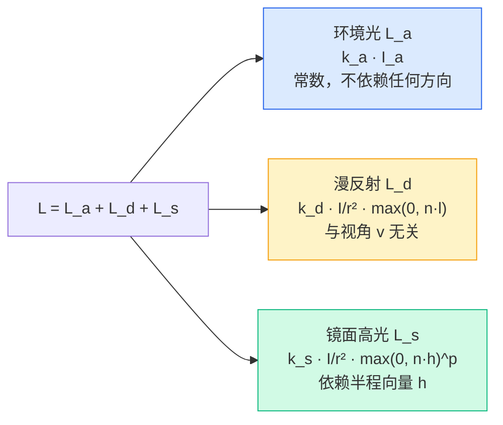

# GAMES101 现代计算机图形学入门 — Lecture 08 学习笔记

## 课程信息

- **课程名称**：GAMES101 现代计算机图形学入门
- **授课教师**：闫令琪（UCSB 助理教授）
- **本节课主题**：Shading 2 — Shading, Pipeline and Texture Mapping（着色——着色、管线与纹理映射）
- **B站视频**：[Lecture 08 - Shading 2 (Shading, Pipeline and Texture Mapping)](https://www.bilibili.com/video/BV1X7411F744?p=8)

---

## 📑 目录

- [零、前情回顾](#零前情回顾从-lecture-07-到-lecture-08)
- [1. Blinn-Phong 镜面高光补充](#1-blinn-phong-镜面高光补充)
- [2. 着色频率中的法线计算](#2-着色频率中的法线计算)
- [3. Shader 编程与 GPU 硬件](#3-shader-编程与-gpu-硬件)
- [4. 纹理映射](#4-纹理映射texture-mapping)
- [5. 关键知识点总结](#5-关键知识点总结)

---

## 零、前情回顾：从 Lecture 07 到 Lecture 08

Lecture 07 建立了着色的基本框架：

> Blinn-Phong 反射模型（环境光 + 漫反射 + 镜面高光） → 三种着色频率（Flat / Gouraud / Phong） → 图形渲染管线

本讲在已有基础上做三件事：

1. **深化**：镜面高光的更多细节（余弦幂函数的行为）、法线计算的具体方法
2. **串联**：Shader 编程实践 + GPU 硬件如何支撑整条管线
3. **拓展**：引入**纹理映射（Texture Mapping）**——在不增加几何面数的前提下为表面添加丰富细节

---

## 1. Blinn-Phong 镜面高光补充

### 1.1 余弦幂函数的行为

镜面高光公式中的 $p$（光泽度指数）是整个模型中最"戏剧性"的参数：

$$L_s = k_s \cdot \frac{I}{r^2} \cdot \max(0, \mathbf{n} \cdot \mathbf{h})^p$$

$\mathbf{n} \cdot \mathbf{h} = \cos \alpha$ 本身随角度变化比较平缓——$\cos$ 函数在 $0^\circ$ 附近下降很慢。**取 $p$ 次幂的本质是用非线性函数"挤压"高光范围**：

> $\cos \alpha$ 曲线（归一化到 $[0,1]$）：
>
> cos^1:  1.00 ████████████████████████████████████████  (几乎全亮)
> cos^10: 1.00 ████████████████▌                         (宽高光)
> cos^50: 1.00 ████████▎                                 (集中高光)
> cos^100:1.00 ████▌                                     (很集中)
> cos^200:1.00 ██▎                                       (极亮小点)

> 📌 $p$ 越大，高光范围越小、越亮（因为是"接近 1 的值的 p 次幂仍然接近 1"，而"略小于 1 的值的 p 次幂趋近于 0"）。

实际应用中的指导：
- $p = 1\sim10$：漫反射为主，高光几乎看不见 → 粉笔、橡胶
- $p = 50\sim100$：可见的集中高光 → 塑料、木材上的光泽
- $p = 200\sim500$：极集中的高光 → 抛光金属、镜面
- $p \to \infty$：完美镜面（只有 $\mathbf{n} = \mathbf{h}$ 时有高光）→ 镜子

### 1.2 Blinn-Phong 模型完整回顾



> 🔑 三个分量各司其职：环境光兜底、漫反射给固有色、镜面高光给质感。三个分量独立计算、直接相加——这就是**经验模型**的思路，"看起来对就行"，不追求物理上的能量守恒。

---

## 2. 着色频率中的法线计算

着色频率（Flat / Gouraud / Phong）在 Lecture 07 中已经介绍过。本讲补充一个实际工程问题：**逐顶点和逐像素的法线从哪来？**

### 2.1 逐顶点法线（Per-Vertex Normal）

对于 Gouraud 和 Phong 着色，都需要知道每个顶点的法线方向。

**理想情况**：如果底层几何体是解析定义的（如球体 $x^2 + y^2 + z^2 = R^2$），可以直接对公式求梯度得到法线 $\mathbf{n} = (x, y, z) / R$。

**一般情况**（三角形网格）：顶点法线 = 相邻面法线的**面积加权平均**：

$$\mathbf{n}_{vertex} = \frac{\sum_i A_i \cdot \mathbf{n}_{face\_i}}{\left\|\sum_i A_i \cdot \mathbf{n}_{face\_i}\right\|}$$

>      \  n_f3  /
>       \  ↑  /
>        \ │ /
>    n_f2 → ● ← n_f1    ← 顶点被三个三角形共享
>        /  │  \
>       /   ↓   \
>      /  n_v    \
>     /  (平均后)  \

> 💡 用**面积**加权而非简单平均：大面积面对顶点外观的贡献更大，面积加权能减少小面（可能是网格细分产生的窄三角形）对法线方向的"噪声"影响。

### 2.2 逐像素法线（Per-Pixel Normal）

在 Phong Shading 中，三角形内部的每个像素需要自己的法线。做法是：

> 三角形的三个顶点有各自的法线 → 用**重心坐标（Barycentric Coordinates）** 在三角形内部插值 → 得到每个像素的法线

> ⚠️ **插值后一定要重新归一化！** 插值得到的法线长度可能 $\neq 1$，不归一化会导致光照计算错误（$\mathbf{n} \cdot \mathbf{l}$ 的值域不再是 $[-1, 1]$）。

重心坐标的具体计算方法将在下一讲（Lecture 09）详细展开——它不仅是法线插值的基础，也是纹理映射中 UV 坐标插值的数学工具。

---

## 3. Shader 编程与 GPU 硬件

### 3.1 Shader 的本质

**Shader（着色器）** 是在 GPU 上运行的、针对单个顶点或单个片元执行的程序：

> 🔑 Shader 的核心范式：**"对每一个 X，执行相同的操作"** → 天然的并行执行。

每个顶点/片元独立运行 Shader 的一份副本（SIMD / SIMT 模式），不同副本之间不通信、不等待。这意味着：

- Shader **不需要 for 循环**遍历所有顶点——GPU 自动并行
- Shader **不能访问相邻像素/顶点的结果**（除非通过 texture 等只读方式）
- Shader 的输入是 uniform（全局常量）+ varying（插值后的逐片元变量）

### 3.2 GLSL Shader 示例

```glsl
// === Vertex Shader ===
uniform mat4 modelViewProjection;  // MVP 矩阵（CPU 传入）
attribute vec3 position;           // 顶点位置（每个顶点不同）
attribute vec3 normal;             // 顶点法线
varying vec3 worldNormal;          // 传给 Fragment Shader（会被插值）

void main() {
    gl_Position = modelViewProjection * vec4(position, 1.0);
    worldNormal = normal;  // 光栅化器会自动插值这个 varying 变量
}
```

```glsl
// === Fragment Shader ===
uniform sampler2D myTexture;      // 纹理（本讲后半部分！）
uniform vec3 lightDir;            // 光源方向
uniform float specularPower;      // 光泽度指数
varying vec3 worldNormal;         // 来自 Vertex Shader（已被光栅化器插值）

void main() {
    vec3 n = normalize(worldNormal);          // 插值后必须归一化！
    vec3 l = normalize(lightDir);
    vec3 v = vec3(0.0, 0.0, 1.0);            // 简化：相机在 +z 方向
    vec3 h = normalize(v + l);

    // 从纹理读取物体固有色（替代 k_d！）
    vec3 kd = texture2D(myTexture, uv).rgb;

    // Blinn-Phong
    float diff = max(0.0, dot(n, l));
    float spec = pow(max(0.0, dot(n, h)), specularPower);

    vec3 ambient = 0.1 * kd;
    vec3 diffuse = diff * kd;
    vec3 specular = spec * vec3(1.0);

    gl_FragColor = vec4(ambient + diffuse + specular, 1.0);
}
```

> 💡 注意 `varying` 关键字的含义：Vertex Shader 输出的值不是直接传给 Fragment Shader 的——**光栅化器**会先在三角形内部做透视校正插值，再将插值结果交给每个片元的 Fragment Shader。这是 Graphics Pipeline 中最容易被忽视的"自动"步骤。

### 3.3 Snail Shader：Shader 的极限

课程中展示了一个由 **Inigo Quilez** 创作的经典 Shadertoy 作品——一个完全用 **800 行 Fragment Shader 程序化建模**的蜗牛：

> - 没有任何 3D 模型文件
> - 没有顶点数据（甚至不需要 Vertex Shader 做复杂计算）
> - 所有几何体（壳、身体、触角）都由数学函数（SDF / Signed Distance Functions）在 Fragment Shader 中实时计算
> - 搭配光照计算，最终渲染出照片级画面

> 💡 这展示了 Shader 的极端用法：**用数学描述世界**。Shadertoy 上的作品（[shadertoy.com](https://www.shadertoy.com)）全部是单 Fragment Shader 完成的——没有模型、没有纹理、没有外部资源，只有数学和创意。

### 3.4 GPU 硬件：为什么能这么快

现代 GPU 是**异构多核处理器**：

| 特性 | CPU | GPU |
|------|-----|-----|
| 核心数 | 4-16 个高性能核 | 数千个简单核 |
| 擅长 | 复杂逻辑、分支、串行任务 | 大量简单计算、并行数据 |
| 设计哲学 | 减少**延迟（Latency）** | 最大化**吞吐量（Throughput）** |
| 算力 | ~100 GFLOPs | ~2-4 TFLOPs |
| 典型任务 | OS、逻辑控制 | 顶点变换、像素着色、矩阵运算 |

> 📌 GPU 不是"比 CPU 快"，而是"比 CPU 更擅长并行"——它用几千个简单核心同时对不同数据执行相同的 Shader 程序。这就是为什么图形管线能实时处理百万级三角形：不是串行处理得快，而是同时处理得多。

---

## 4. 纹理映射（Texture Mapping）

这是本讲真正的**新内容**。前面的 Blinn-Phong 模型中，$k_d$（漫反射系数）是一个统一的值——整个物体表面颜色一致。但真实世界的物体表面有丰富的颜色变化。

> 🔑 **纹理映射的核心思想**：用一张二维图像来定义物体表面每个点的外观属性（漫反射颜色、法线方向、光泽度等），替代 Blinn-Phong 中的统一系数。

### 4.1 问题：不同位置，不同颜色

在 Lecture 07 的 Blinn-Phong 模型中：

$$L_d = k_d \cdot \frac{I}{r^2} \cdot \max(0, \mathbf{n} \cdot \mathbf{l})$$

$k_d$ 是一个**常数**——意味着整个物体只有一种固有色。但真实世界呢？

> 🏀 篮球上有纹路      🪵 地板上有木纹      👕 衣服上有图案

这些颜色变化如果全部用几何体（三角形）来建模，面数会爆炸。**纹理映射用一张图片就解决了这个问题**。

### 4.2 纹理就是一张二维图像

每张纹理图是一张二维图像，每个像素称为一个**纹素（Texel）**。表面上的每个 3D 点，在纹理图上都有对应的 2D 位置。

>                  3D 世界空间                          2D 纹理空间
>
>              y                                            v
>              ↑                                            ↑
>              │    ●(x,y,z)                                │
>              │   /  \                                     │   ┌──────────┐
>              │  /    \      映射                           │   │ ●(u,v)   │
>              │ / ★    \    ────→                          │   │          │
>              │/________\                                  │   └──────────┘
>              └──────────→ x                               └──────────→ u
>             / z

### 4.3 纹理坐标（UV 坐标）

每个三角形顶点被赋予一个**纹理坐标 $(u, v)$**：

| 坐标 | 含义 | 范围 |
|------|------|------|
| $u$ | 纹理水平方向（横向） | 通常 $[0, 1]$ |
| $v$ | 纹理垂直方向（纵向） | 通常 $[0, 1]$ |

> 📌 纹理坐标习惯上称为 **UV 坐标**（避免和世界空间的 $x, y, z$ 混淆）。通常 $(0, 0)$ 在纹理左下角，$(1, 1)$ 在右上角。

三角形的三个顶点各有一个 UV 坐标。三角形内部的 UV 坐标由**重心坐标插值**得到（Lecture 09 详细讲），然后用插值后的 $(u, v)$ 去纹理图中查找颜色。


### 4.4 纹理坐标可视化

课程中展示了一种直观理解 UV 坐标的方法——将 $(u, v)$ 直接当作颜色（$R=u, G=v, B=0$）渲染出来：

> ┌────────────────────┐
> │ 绿 (0,1)           │  顶部 v=1，呈绿色
> │                    │
> │  黄 (1,1)          │  右上角 u=1, v=1，红+绿 = 黄
> │                    │
> │ 黑 (0,0)  红 (1,0) │  底部 v=0，无绿色；左边 u=0，无红色
> └────────────────────┘

通过这种可视化，可以直观检查模型的 UV 展开是否合理——如果 UV 可视化出现明显的拉伸或扭曲，意味着纹理贴到模型上也会失真。

### 4.5 纹理的实际应用

纹理不仅限于存储颜色（$k_d$），它可以存储任何"逐点变化"的表面属性：

| 纹理类型 | 存储内容 | 用途 |
|---------|---------|------|
| **漫反射贴图（Diffuse Map）** | 物体固有色 $k_d$ | 替代统一的 $k_d$ 系数 |
| **法线贴图（Normal Map）** | 逐点法线扰动 | 在不增加几何面数的前提下模拟凹凸细节 |
| **高光贴图（Specular Map）** | 逐点 $k_s$ 或 $p$ | 不同区域有不同的光泽度 |
| **环境光遮蔽贴图（AO Map）** | 逐点遮蔽信息 | 模拟细小几何体间的阴影 |
| **高度贴图（Height Map）** | 逐点高度偏移 | 凹凸映射/视差映射的基础 |

> 💡 纹理的本职工作是一张"查找表"——给定 $(u, v)$，返回一个值（颜色/法线/标量）。这个"值"是什么完全取决于你用它做什么。现代渲染中，一个材质可能有十几种不同的纹理贴图。

### 4.6 纹理的复用与平铺

同一张纹理可以被多个三角形共享（例如一个足球表面由许多三角形组成，但都引用同一张皮革纹理）。纹理也可以**平铺（Tiling）**——通过让 UV 超出 $[0,1]$ 范围并在采样时取小数部分来重复图案：

```glsl
// GLSL 中：使用 GL_REPEAT 或手动 fract
vec2 tiledUV = fract(uv * repeatCount);  // 或直接用 GL_REPEAT 包装模式
vec3 color = texture2D(myTexture, tiledUV).rgb;
```

这在需要覆盖大面积表面（如地板、墙壁）时非常有用——只需要一张小纹理+重复采样，而不是一张巨大纹理。

---

## 5. 关键知识点总结

| # | 知识点 | 核心要点 |
|---|--------|---------|
| 1 | **余弦幂函数** | $p$ 控制高光范围；$p$ 越大高光越小越亮；本质是用非线性函数"挤压"cos 曲线 |
| 2 | **顶点法线计算** | 相邻面法线的**面积加权平均**，大面积面权重更大 |
| 3 | **逐像素法线插值** | 用重心坐标在三角形内插值顶点法线；**插值后必须归一化** |
| 4 | **Shader 范式** | 对每个顶点/片元执行相同程序，GPU 并行执行数千份副本 |
| 5 | **GPU vs CPU** | CPU 追求低延迟（串行快），GPU 追求高吞吐（并行多）；GPU 有数千个简单核心 |
| 6 | **纹理映射本质** | 用 2D 图像定义表面逐点属性，避免用几何体建模细节 |
| 7 | **UV 坐标** | $(u, v) \in [0, 1]^2$，三角形顶点赋 UV → 光栅化器插值 → 片元查询纹理 |
| 8 | **纹理不只是颜色** | Diffuse/Normal/Specular/AO/Height Map 等，纹理是通用"查找表" |
| 9 | **纹理平铺** | 利用 UV 重复采样实现小纹理覆盖大面积表面 |

---

---

## 🎬 课程视频

- **B站链接**：[Lecture 08 - Shading 2 (Shading, Pipeline and Texture Mapping)](https://www.bilibili.com/video/BV1X7411F744?p=8)

<iframe src="//player.bilibili.com/player.html?bvid=BV1X7411F744&p=8"
        scrolling="no"
        border="0"
        frameborder="no"
        framespacing="0"
        allowfullscreen="true"
        width="100%"
        height="500">
</iframe>

---

**参考资料**：
- GAMES101 Lecture 08 课程视频及课件
- 闫令琪老师课程网站 http://www.cs.ucsb.edu/~lingqi/teaching/games101.html
- Shadertoy (Inigo Quilez 作品) https://www.shadertoy.com
- Foley, van Dam, Feiner, Hughes — *Computer Graphics: Principles and Practice*
