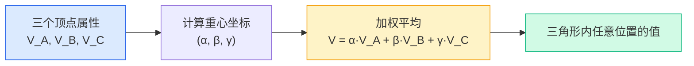
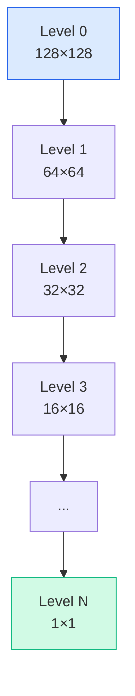
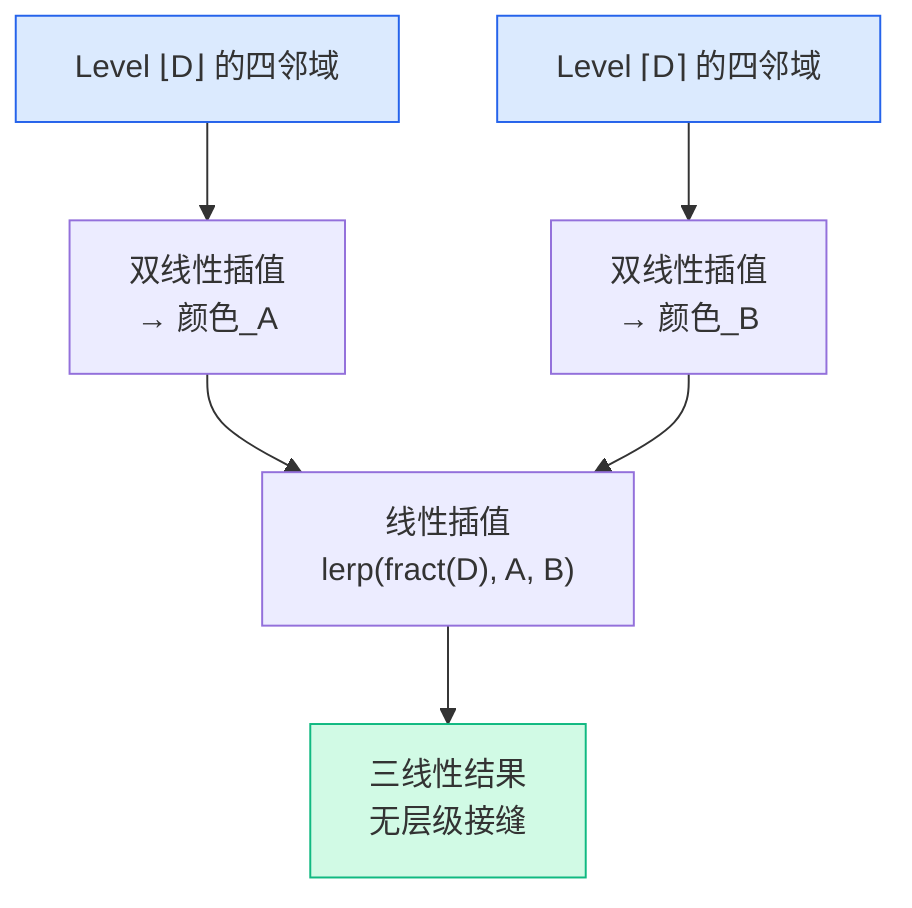

# GAMES101 现代计算机图形学入门 — Lecture 09 学习笔记

## 课程信息

- **课程名称**：GAMES101 现代计算机图形学入门
- **授课教师**：闫令琪（UCSB 助理教授）
- **本节课主题**：Shading 3 — Texture Mapping cont.（着色——纹理映射续：重心坐标、纹理采样、Mipmap）
- **B站视频**：[Lecture 09 - Shading 3 (Texture Mapping cont.)](https://www.bilibili.com/video/BV1X7411F744?p=9)

---

## 📑 目录

- [零、前情回顾](#零前情回顾uv-坐标之后的下一个问题)
- [1. 重心坐标](#1-重心坐标barycentric-coordinates)
- [2. 纹理放大与双线性插值](#2-纹理放大与双线性插值)
- [3. 纹理缩小与-Mipmap](#3-纹理缩小与-mipmap)
- [4. 各向异性过滤](#4-各向异性过滤anisotropic-filtering)
- [5. 关键知识点总结](#5-关键知识点总结)

---

## 零、前情回顾：UV 坐标之后的下一个问题

Lecture 08 建立了纹理映射的基本框架：

> 三角形顶点赋 UV → 光栅化器插值 → 片元用 $(u,v)$ 查纹理 → 得到 $k_d$ → Blinn-Phong

但这条链路上还有三个核心问题没解决：

| 问题 | 场景 | 本讲答案 |
|------|------|---------|
| 三角形**内部**的 UV 怎么算？ | 光栅化产生了三角形内部的像素 | **重心坐标**（Barycentric Coordinates） |
| 纹理**太小**被拉大怎么办？ | 低分辨率纹理贴到大面积表面 | **双线性插值**（Bilinear Interpolation） |
| 纹理**太大**被缩小怎么办？ | 远处物体，一个像素覆盖多个纹素 | **Mipmap + 三线性插值**（Trilinear Interpolation） |

> 📌 这三个问题分别对应：插值方法、上采样（Magnification）、下采样（Minification）。它们共同构成了**纹理滤波（Texture Filtering）** 的完整图景。

---

## 1. 重心坐标（Barycentric Coordinates）

### 1.1 为什么要插值？

在光栅化阶段，GPU 只知道三角形**顶点**的数据——顶点的 UV 坐标、法线、颜色等。但 Fragment Shader 需要的是**每个片元**（三角形内部）的数据。

> 🔑 **重心坐标是三角形内部插值的标准数学工具**——给定三个顶点的值，用重心坐标可以算出三角形内任意位置的平滑过渡值。

可以插值的属性包括：

| 属性 | 用途 |
|------|------|
| UV 坐标 | 纹理查找 |
| 法线向量 | Phong Shading |
| 颜色 | Gouraud Shading |
| 深度值 | Z-Buffer |
| 世界空间位置 | 逐像素光照 |

### 1.2 定义

对于三角形 $ABC$，其所在平面内的任意一点 $(x, y)$ 可以唯一表示为三个顶点的线性组合：

$$(x, y) = \alpha A + \beta B + \gamma C$$

$$\alpha + \beta + \gamma = 1$$

$(\alpha, \beta, \gamma)$ 就是该点的**重心坐标（Barycentric Coordinates）**。

>                    C
>                   /|\
>                  / | \
>                 /  |  \
>                /   |   \
>               /    ●    \
>              /   (x,y)   \
>             /             \
>            A───────────────B
>
>      (x,y) = α·A + β·B + γ·C
>      α + β + γ = 1

> 📌 三个分量都在 $[0, 1]$ 之间，且和为 1。可以理解为三个顶点对当前点"贡献的权重"。

### 1.3 几何视角：面积比

重心坐标有一个优雅的几何解释——**面积之比**：

>                    C
>                   / \
>                  / A \
>                 /  α   \
>                /       \
>               A─────────B
>
>      α = 对顶点 A 的子三角形面积 / 总面积
>      β = 对顶点 B 的子三角形面积 / 总面积
>      γ = 对顶点 C 的子三角形面积 / 总面积

$$\alpha = \frac{A_A}{A_A + A_B + A_C} \quad \beta = \frac{A_B}{A_A + A_B + A_C} \quad \gamma = \frac{A_C}{A_A + A_B + A_C}$$

其中 $A_A$ 是**与顶点 A 相对的那个子三角形**的面积（即由 $(x,y)$、$B$、$C$ 围成的三角形）。

**特殊情况**：
- 顶点 A：$(\alpha, \beta, \gamma) = (1, 0, 0)$
- 顶点 B：$(\alpha, \beta, \gamma) = (0, 1, 0)$
- 顶点 C：$(\alpha, \beta, \gamma) = (0, 0, 1)$
- **重心（Centroid）**：$(\alpha, \beta, \gamma) = (\frac{1}{3}, \frac{1}{3}, \frac{1}{3})$

> 💡 **点在三角形内的判定**：三个分量都 $\geq 0$ → 在三角形内部。任何一个分量 $< 0$ → 在三角形外部。这个性质在光栅化中的"点是否在三角形内"测试中非常有用（可以替代叉积法）。

### 1.4 计算公式

给定三角形三个顶点 $A(x_A, y_A)$、$B(x_B, y_B)$、$C(x_C, y_C)$ 和待求点 $P(x, y)$：

$$\alpha = \frac{(x - x_B)(y_C - y_B) - (y - y_B)(x_C - x_B)}{(x_A - x_B)(y_C - y_B) - (y_A - y_B)(x_C - x_B)}$$

$$\beta = \frac{(x - x_C)(y_A - y_C) - (y - y_C)(x_A - x_C)}{(x_B - x_C)(y_A - y_C) - (y_B - y_C)(x_A - x_C)}$$

$$\gamma = 1 - \alpha - \beta$$

> 💡 分子分母中的每个 $(x_a - x_b)(y_c - y_b) - (y_a - y_b)(x_c - x_b)$ 都是**叉积**——计算的是对应三角形面积的 2 倍。所以这个公式本质就是在算面积比。

### 1.5 用重心坐标插值

有了重心坐标后，三角形内部的任意属性都可以通过加权平均得到：

$$V = \alpha V_A + \beta V_B + \gamma V_C$$

其中 $V_A, V_B, V_C$ 可以是任何顶点属性——位置、UV、颜色、法线、深度、甚至材质属性。



### 1.6 ⚠️ 关键坑：投影后会变！

> 🔑 **重心坐标在投影变换后不是不变的！**

这意味着：
- ❌ **不能在屏幕空间（投影后）用重心坐标插值 3D 属性**
- ✅ 必须做**透视校正插值（Perspective-Correct Interpolation）**

> ⚠️ 一个简单的例子：三角形投影到屏幕后，远处的顶点靠得更近。如果你在屏幕空间做线性插值，远处部分的纹理看起来会扭曲变形。这也是为什么 GLSL 中的 `varying` 变量是 GPU 硬件自动做透视校正的结果——你不知道不代表它没发生。

> 💡 透视校正的核心思想：在屏幕空间插值 $V/z$（属性除以深度），同时插值 $1/z$，然后每个片元用 $V = (V/z) / (1/z)$ 恢复原始属性。这个操作由 GPU 硬件自动完成，但理解它很重要——否则 debug 纹理变形问题时你会毫无头绪。

---

## 2. 纹理放大与双线性插值

### 2.1 问题：纹理太小

当一张低分辨率纹理（如 64×64）贴到占据屏幕上很大区域的表面时，会出现**纹理放大（Texture Magnification）**——多个屏幕像素映射到同一个纹素（Texel）：

> 屏幕像素:  ┌─┬─┬─┬─┐
>            ├─┼─┼─┼─┤      → 每个像素查到的 UV 坐标落在纹素之间
>            └─┴─┴─┴─┘
>
> 纹理图:    ┌───┬───┐
>            │ A │ B │      64×64，格子很大
>            ├───┼───┤
>            │ C │ D │
>            └───┴───┘

三种处理方案：

| 方法 | 做法 | 效果 | 开销 |
|------|------|------|------|
| **Nearest（最近邻）** | 取离 $(u,v)$ 最近的纹素颜色 | 明显的像素格子/马赛克 | 最小 |
| **Bilinear（双线性）** | 取周围 4 个纹素，做三次线性插值 | 平滑但有轻微模糊 | 中等 |
| **Bicubic（双三次）** | 取周围 16 个纹素，做三次样条插值 | 最平滑、最锐利 | 较高 |

### 2.2 双线性插值（Bilinear Interpolation）详解

这是实际中最常用的方案，开销适中，效果足够好。

给定采样点 $(u, v)$ 周围最近的 4 个纹素 $u_{00}, u_{10}, u_{01}, u_{11}$，以及采样点相对 $u_{00}$ 的偏移量 $(s, t) \in [0, 1]^2$：

>           u01  ←──────────→  u11
>            ┌────────────────┐
>            │                │
>        t   │    ●(s,t)      │   采样点在四个纹素之间
>            │                │
>            └────────────────┘
>           u00  ←──────────→  u10
>                    s

**三步走**（两次水平 + 一次垂直）：

```glsl
// 线性插值函数
float lerp(float x, float v0, float v1) {
    return v0 + x * (v1 - v0);
}

// 步骤 1：在底部做水平插值
u0 = lerp(s, u00, u10);

// 步骤 2：在顶部做水平插值
u1 = lerp(s, u01, u11);

// 步骤 3：在垂直方向插值两个结果
final = lerp(t, u0, u1);
```

> 💡"双线性"这个名字的含义：在两个方向（水平→垂直）各做一次**线性**插值。虽然整体结果不是线性的（是二次的），但每个方向上的操作都是线性的。

### 2.3 效果对比

> Nearest:   ████████░░░░░░░░  硬边、马赛克感
> Bilinear:  ████████▓▓▓▓░░░░  平滑过渡，略有模糊
> Bicubic:   ████████▓▓▓▓▓░░░  更锐利的过渡，保留高频细节

在绝大多数实时渲染中，**Bilinear 是默认选择**——它是质量和性能之间的最佳平衡点。

---

## 3. 纹理缩小与 Mipmap

### 3.1 问题：纹理太大

当纹理分辨率很高（如 1024×1024），但屏幕像素覆盖的纹理区域很大时（如远处的地面），一个屏幕像素对应纹理中的**几百甚至几千个纹素**。

>          屏幕空间                            纹理空间
> 
>      ┌────┐                          ┌─────────────────┐
>      │ ●  │  一个像素                  │   ┌─────────┐   │
>      └────┘                          │   │ 几百个   │   │
>                                      │   │ 纹素！   │   │
>                                      │   └─────────┘   │
>                                      └─────────────────┘

如果只用点采样（取 UV 坐标对应的那一个纹素颜色），会出大问题：

> ⚠️ **走样（Aliasing）**：近处的纹理像素和远处的纹理像素，相邻帧取到的纹素可能完全不同 → 产生锯齿（Jaggies）和**摩尔纹（Moiré Pattern）**。

### 3.2 点查询 vs 范围查询

这是本讲最核心的洞察：

| | 纹理放大（Magnification） | 纹理缩小（Minification） |
|------|--------------------------|--------------------------|
| 本质 | **上采样** | **下采样** |
| 需要什么 | 点之间的插值（填补未知值） | 范围内的平均值（汇总已知值） |
| 解决方案 | Bilinear（点查询，插值） | Mipmap（**范围查询**，求平均） |

> 🔑 纹理缩小是一个**信号处理问题**——当纹素的频率远高于屏幕像素的采样频率时，直接点采样会违反奈奎斯特定理，产生走样。必须先用低通滤波器（范围平均）降低信号频率。

### 3.3 超级采样能解决吗？

能，但代价太高。课程展示了 512× 超级采样确实能消除走样——但每个像素要采样大量点（几百到几千），在实际应用中不可行。

> 💡 既然问题是在走样之前先"降频"，不如**提前把降频后的结果算好存起来**——这就是 Mipmap 的动机。

### 3.4 Mipmap（多级渐远纹理）

**Mipmap**（Lance Williams, 1983）是一个**预计算的图像金字塔**：

> Level 0: 128×128  ████████████████████████████████  (原始纹理)
> Level 1: 64×64    ████████████████                  (每 2×2 平均为 1 个像素)
> Level 2: 32×32    ████████
> Level 3: 16×16    ████
> Level 4: 8×8      ██
> Level 5: 4×4      █
> Level 6: 2×2      ▌
> Level 7: 1×1      ·                                (整个纹理的平均色)

每一级是上一级在每个方向上缩小一半（面积 = 1/4）。



### 3.5 存储开销：只有 1/3

一个乍看之下会担心的问题：存这么多层，是不是要多一倍空间？

答案是否定的——额外存储只有原始纹理的 **1/3**：

$$\text{额外} = \frac{1}{4} + \frac{1}{16} + \frac{1}{64} + \cdots = \frac{1/4}{1 - 1/4} = \frac{1}{3}$$

> 💡 几何级数的直觉：每一层是上一层的 1/4，所有额外层的总和 = 原来的 1/3。用 33% 的额外空间换取巨大的性能/质量收益——这是图形学中最"赚"的 trade-off 之一。

### 3.6 如何选择 Mipmap 层级 D

给定一个屏幕像素，如何知道应该查第几层 Mipmap？核心思路：**看相邻屏幕像素在纹理空间中的距离**。

>          屏幕空间 (x,y)                    纹理空间 (u,v)
>
>      ┌──┬──┬──┐                      
>      │  │● │● │  相邻像素               (u₀₀,v₀₀) ←→ (u₁₀,v₁₀)
>      ├──┼──┼──┤  在屏幕上是 1px 距离            ↑ 映射
>      │  │  │  │                         (u₀₁,v₀₁) ←→ (u₁₁,v₁₁)
>      └──┴──┴──┘

用屏幕像素在纹理空间覆盖的"脚印"（Footprint）最大边长 $L$ 来决定层级：

$$L = \max\left(\sqrt{\left(\frac{du}{dx}\right)^2 + \left(\frac{dv}{dx}\right)^2},\ \sqrt{\left(\frac{du}{dy}\right)^2 + \left(\frac{dv}{dy}\right)^2}\right)$$

$$D = \log_2 L$$

- $L = 1$（一个像素覆盖约 1 个纹素）→ $D = 0$（用原始纹理）
- $L = 4$（一个像素覆盖约 16 个纹素）→ $D = 2$（用 32×32 层级）
- $L = 64$（一个像素覆盖约 4096 个纹素）→ $D = 6$（用 2×2 层级）

> 💡 GPU 硬件在光栅化阶段自动计算这些偏导数 $\frac{du}{dx}, \frac{dv}{dx}, \frac{du}{dy}, \frac{dv}{dy}$——你在 Fragment Shader 中调用 `texture2D()` 时，GPU 已经算好了应该用哪一层 Mipmap。

### 3.7 Mipmap 层级可视化

将层级 D 可视化为颜色：

> D = 0 (近处，原始纹理):   ■■■■■■  (红色 → 原始 128×128 纹理)
> D = 1:                   ■■■■■   (橙色 → 64×64)
> D = 2:                   ■■■■    (黄色 → 32×32)
> D = 3:                   ■■■     (绿色 → 16×16)
> D = 4:                   ■       (蓝色 → 远处，极低分辨率)

如果直接对 D 取整后采样（**Nearest Level**），层级之间会出现明显的**接缝**——就像地图缩放时突然跳变。

### 3.8 三线性插值（Trilinear Interpolation）

为解决层级之间的接缝问题，在三线性插值中：

1. 在 **Level floor(D)** 做一次**双线性插值**（得结果 A）
2. 在 **Level ceil(D)** 做一次**双线性插值**（得结果 B）
3. 在 D 的**小数部分**做一次**线性插值**：结果 = lerp(fract(D), A, B)



- 总共需要查询 **8 个纹素**（两个层级各 4 个）
- GPU 硬件对这类查找有专门优化
- 结果：层级之间平滑过渡，无可见接缝

### 3.9 Mipmap 的局限

Mipmap 有一个根本假设：屏幕像素在纹理空间的脚印是**正方形**的（各向同性/Isotropic）。但实际场景中，脚印往往是细长的矩形或不规则形状：

> 各向同性 (Mipmap 假设):       实际情况:
>
>     ┌──┐                       ┌──────────┐
>     │  │  正方形                │          │  细长的矩形
>     └──┘                       └──────────┘
>                                (如：以掠射角看地面)

> ⚠️ 当脚印是细长矩形时，Mipmap 只能用**能包含整个脚印的最小正方形**去近似，导致范围过大——结果就是远处纹理**过度模糊（Overblur）**。

---

## 4. 各向异性过滤（Anisotropic Filtering）

### 4.1 各向同性 vs 各向异性

| | Mipmap | Anisotropic Filtering |
|------|--------|----------------------|
| 脚印形状 | 只能正方形 | 矩形（各方向不同分辨率） |
| 结果 | 远处过度模糊 | 远处保持细节 |
| 额外存储 | 1/3 | 约 3×（Ripmap） |
| 开销 | 最低 | 更高（可控级别） |

### 4.2 Ripmap

**Ripmap**（Rectangular Mipmap）是 Mipmap 的扩展——不仅预计算正方形降采样，还预计算**各方向独立的降采样**：

> 原始纹理 128×128
>     ↓
> 128×64   64×128            ← 只在 u 或 v 一个方向降采样
>     ↓
> 128×32   64×64   32×128
>     ↓
> ...

这样对于细长的矩形脚印，可以分别查询 u 和 v 两个方向对应的降采样层级，组合出更匹配的结果。

> 💡 Ripmap 的问题是**额外存储大得多**（约 3× 原始纹理，对比 Mipmap 的 1/3），且只能处理轴对齐的矩形——斜向的脚印仍然有问题。

### 4.3 EWA 过滤

**EWA（Elliptical Weighted Average）** 过滤是更通用的方案，可以将任意椭圆形的脚印映射到 Mipmap 层级上做加权平均——处理所有方向的脚印（包括 Mipmap 处理不了的对角线拉伸）。

> 📌 实践中，现代 GPU 提供的"各向异性过滤"设置（2×/4×/8×/16×）控制的是在非正方形方向上的额外采样数。设置为 16× 意味着就算脚印非常细长，GPU 也会做足够多次的采样来保证质量——画质提升明显，但在极端场景会有性能开销。

---

## 5. 关键知识点总结

| # | 知识点 | 核心要点 |
|---|--------|---------|
| 1 | **重心坐标** | 三角形内部任意点 $= \alpha A + \beta B + \gamma C$，$\alpha+\beta+\gamma=1$；几何意义是面积比 |
| 2 | **重心坐标用途** | 插值一切顶点属性（UV、法线、颜色、深度）；$\alpha,\beta,\gamma \geq 0$ 即点在三角形内 |
| 3 | **投影后变化** | 重心坐标在投影变换后**不是不变的**！需要透视校正插值（GPU 硬件自动做） |
| 4 | **纹理放大** | 纹理太小 → 上采样；Nearest（马赛克）→ Bilinear（平滑，开销适中）→ Bicubic（最锐利） |
| 5 | **双线性插值** | 两次水平 lerp + 一次垂直 lerp = 总共 3 次线性插值；只查 4 个纹素 |
| 6 | **纹理缩小** | 纹理太大 → 下采样；点采样会产生锯齿/摩尔纹（走样），需要**范围查询** |
| 7 | **Mipmap** | 预计算图像金字塔（每层 1/4）；额外存储仅 1/3；用相邻像素 UV 偏导计算层级 D |
| 8 | **三线性插值** | Bilinear(Level D) + Bilinear(Level D+1) + lerp(fract(D))；查 8 个纹素，消除层级接缝 |
| 9 | **Mipmap 局限** | 假设正方形脚印 → 掠射角/细长矩形时过度模糊（Overblur） |
| 10 | **各向异性过滤** | Ripmap / EWA 处理矩形/椭圆脚印；存储和开销更大，但远处细节保留更好 |

---

## 🎬 课程视频

- **B站链接**：[Lecture 09 - Shading 3 (Texture Mapping cont.)](https://www.bilibili.com/video/BV1X7411F744?p=9)

<iframe src="//player.bilibili.com/player.html?bvid=BV1X7411F744&p=9"
        scrolling="no"
        border="0"
        frameborder="no"
        framespacing="0"
        allowfullscreen="true"
        width="100%"
        height="500">
</iframe>

---

**参考资料**：
- GAMES101 Lecture 09 课程视频及课件
- 闫令琪老师课程网站 http://www.cs.ucsb.edu/~lingqi/teaching/games101.html
- Lance Williams, *Pyramidal Parametrics* (Mipmap 原始论文), SIGGRAPH 1983
- Paul Heckbert, *Fundamentals of Texture Mapping and Image Warping* (EWA 过滤与纹理映射综述)
