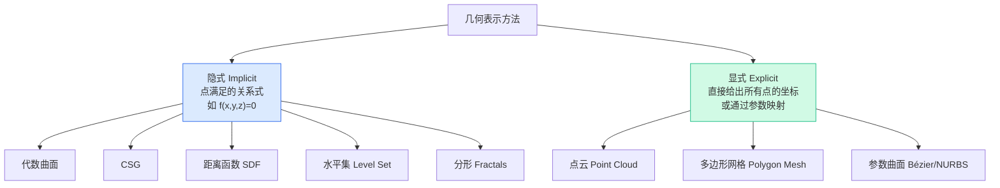
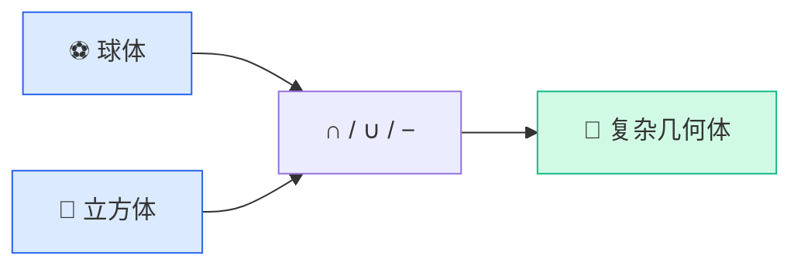
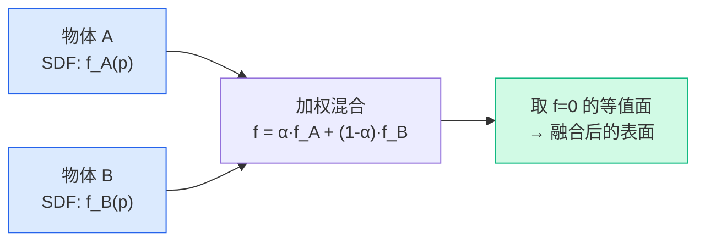
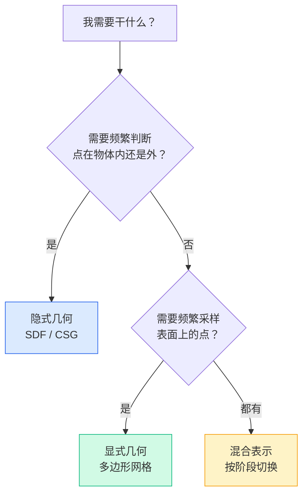

# GAMES101 现代计算机图形学入门 — Lecture 10 学习笔记

## 课程信息

- **课程名称**：GAMES101 现代计算机图形学入门
- **授课教师**：闫令琪（UCSB 助理教授）
- **本节课主题**：Geometry 1 — Textures Applications & Geometry Introduction（纹理应用续 + 几何表示入门）
- **B站视频**：[Lecture 10 - Geometry 1 (Textures Applications & Introduction)](https://www.bilibili.com/video/BV1X7411F744?p=10)

---

## 📑 目录

- [零、前情回顾](#零前情回顾纹理不止是-k_d)
- [1. 环境贴图](#1-环境贴图environment-map)
- [2. 凹凸贴图与法线贴图](#2-凹凸贴图与法线贴图bump--normal-mapping)
- [3. 位移贴图](#3-位移贴图displacement-mapping)
- [4. 三维程序纹理与体渲染](#4-三维程序纹理与体渲染)
- [5. 几何表示的两种基本方法](#5-几何表示的两种基本方法)
- [6. 隐式几何](#6-隐式几何implicit-geometry)
- [7. 显式几何](#7-显式几何explicit-geometry)
- [8. 隐式-vs-显式没有银弹](#8-隐式-vs-显式没有银弹)
- [9. 关键知识点总结](#9-关键知识点总结)

---

## 零、前情回顾：纹理不止是 k_d

Lecture 08-09 把纹理当作"贴在表面的颜色图"——查 UV 值 → 得到漫反射系数 $k_d$ → 代入 Blinn-Phong。但闫老师在这一讲开头就打破了这个狭窄的理解：

> 🔑 **纹理 = GPU 中的一块内存 + 范围查询（滤波）**。这块内存里存的可以是任何东西——颜色、法线方向、高度值、光照信息……只要能塞进内存并且支持快速范围查询，就是纹理。

这一讲的前半部分展示纹理的几种高级用途——它们不属于"几何表示"，但恰好是纹理和几何的交叉地带，作为两章之间的桥梁。

---

## 1. 环境贴图（Environment Map）

### 1.1 核心思路

用纹理描述**来自四面八方的环境光照**。假设光源在无限远处——只记录方向，不考虑实际距离。

> 场景中的物体需要反射环境光时，用表面法线（或反射方向）去查询这个"环境纹理"，得到该方向的环境光颜色。**不需要实际的光源和光线追踪。**

### 1.2 球形环境贴图（Spherical Environment Map）

把环境光照记录在一个球面上，再展开成二维纹理：

> ✅ 直观，概念简单
> 
> ⚠️ 球面展开成平面必然有扭曲——就像世界地图的墨卡托投影，**两极（顶部和底部）严重变形**，纹理利用率低

### 1.3 立方体贴图（Cube Map / 天空盒）

把球面上的信息映射到立方体的**六个面**上：

>                ┌─────────┐
>                │  +Y 顶  │
>                │         │
>       ┌────────┼─────────┼────────┬────────┐
>       │  -Z 后 │  -X 左  │ +Z 前  │ +X 右  │
>       │         │         │        │        │
>       └────────┼─────────┼────────┴────────┘
>                │  -Y 底  │
>                │         │
>                └─────────┘

> 给定一个方向向量 $(x, y, z)$，找到它与立方体哪个面相交，取交点坐标作为纹理 UV。

| | 球形贴图 | 立方体贴图 |
|------|--------|----------|
| 扭曲 | 严重（两极） | 大幅减少 |
| 存储 | 一张图 | 六张图 |
| 查询 | 直接映射 | 先判断方向属于哪个面 |
| 使用广泛度 | 早期使用 | **现代主流** |

> 💡 立方体贴图在游戏中无处不在——天空盒、反射材质（金属/水面反射环境）、甚至 PBR 工作流里的 IBL（Image-Based Lighting）都是它的身影。

---

## 2. 凹凸贴图与法线贴图（Bump / Normal Mapping）

### 2.1 动机：不增加三角形，但增加细节

> 砖墙的缝隙、皮革的纹理、皮肤的毛孔——如果每个都用三角形建模，面数爆炸。但只用颜色纹理又缺乏立体感。

**凹凸贴图的核心思想**：纹理不存颜色，存每个点沿法线方向的**相对高度**。着色时，用高度差扰动物体表面的法线方向——**欺骗着色器**，让平坦的表面看起来有凹凸起伏。

> 🔑 几何体没有变——三角形数量不变，物体轮廓（边缘）仍然是平的。但法线变了，着色结果变了，视觉上"看起来"有凹凸。

### 2.2 法线如何被扰动

以最简单的 1D 情况（水平线上的一个点）为例：

> 原始表面：────────────────   法线 n(p) = (0, 1)，直指上方
>
> 加凹凸后：  ───╱╲───╱╲───   每个点的"高度"不同
>             │    │
>             p    p+1

点 $p$ 处的高度是 $h(p)$，相邻点 $p+1$ 处的高度是 $h(p+1)$。这个高度差产生了一个**切向变化量**：

$$dp = c \cdot [h(p+1) - h(p)]$$

其中 $c$ 是凹凸强度系数。扰动后的法线方向变为：

$$n = (-dp, 1) \quad \text{（归一化后）}$$

推广到 **3D 表面**。原始法线是 $(0, 0, 1)$（局部坐标系中直指上方），分别计算 u 方向和 v 方向的切线变化：

$$\frac{dp}{du} = c_1 \cdot [h(u+1) - h(u)]$$

$$\frac{dp}{dv} = c_2 \cdot [h(v+1) - h(v)]$$

扰动后法线：

$$n = \left(-\frac{dp}{du},\ -\frac{dp}{dv},\ 1\right)$$

**归一化**后，再通过 TBN 矩阵（Tangent-Bitangent-Normal）从局部坐标变换回世界坐标。

> 💡 实际编程中，你不会手工算这个——GPU 的纹理采样和 shader 里的 `fwidth()` 等偏导函数已经帮你算好了。

### 2.3 法线贴图（Normal Mapping）

凹凸贴图存的是**高度值**（一维标量），着色时实时算导数 → 扰动法线。

法线贴图则是**直接把扰动后的法线向量 $(r, g, b)$ 存进纹理**——即法线的颜色编码。效果一样，但省了实时计算导数的步骤，查询更快。现代游戏引擎几乎都用法线贴图。

> 📌 法线贴图中通常用 blue channel 存法线的 z 分量，所以法线贴图整体偏蓝色——这是辨认它的最快方法。

---

## 3. 位移贴图（Displacement Mapping）

### 3.1 凹凸贴图的致命缺陷

凹凸贴图"只改法线不改几何"，有两个场景会**露馅**：

- **物体边缘**：边缘轮廓仍然是光滑的，毫无凹凸
- **自身阴影**：凹凸表面不会互相遮挡光照

### 3.2 位移贴图：真改几何

位移贴图和凹凸贴图使用**同一张高度纹理**，但它**真的移动了顶点的物理位置**。和凹凸贴图对比：

| | 凹凸贴图 | 位移贴图 |
|------|--------|---------|
| 改变几何体？ | ❌ 不改 | ✅ 真的移动顶点 |
| 边缘轮廓 | 露馅（光滑） | ✅ 正确凹凸 |
| 自身阴影 | 不产生 | ✅ 正确遮挡 |
| 性能要求 | 低 | **高**——三角形必须足够密 |

> ⚠️ 位移贴图要求模型的三角形顶点间距 ≤ 纹理定义的细节频率。如果三角形太大，高频的凹凸细节会丢失。

### 3.3 DirectX 动态曲面细分（Tessellation）

现代 GPU 的解决方案：**需要时再细分**。

> 先用粗糙模型 → 位移贴图标记哪些区域需要凹凸细节 → GPU 动态拆分三角形（在曲面细分阶段） → 再沿法线方向移动新顶点

这样既保持了细节，又不用从一开始就存储巨量三角形。

---

## 4. 三维程序纹理与体渲染

### 4.1 3D 程序噪声（Perlin Noise）

不是一张真实的二维图片，而是定义在**三维空间中的噪声函数**——对空间中的任意点 $(x, y, z)$ 都能算出噪声值。

> Perlin 噪声、Worley 噪声等是标准工具。可以模拟大理石纹理、木材年轮、山脉起伏——剖开物体，内部纹理自然连续。

### 4.2 预计算光照（Precomputed Shading）

把提前算好的光照/阴影信息（如环境光遮蔽 Ambient Occlusion）**烘焙**到纹理里。运行时不需要重新算光照——直接查纹理。

### 4.3 三维纹理与体渲染（Volume Rendering）

CT、MRI 的数据是**三维的**——每个体素（Voxel）存一个密度/温度值。三维纹理就是用来存和查这些数据的工具。

> 📌 体渲染在医学可视化、烟雾模拟、云渲染等领域广泛使用。本课程后面可能不会展开，但要知道纹理的这个维度。

---

## 5. 几何表示的两种基本方法

从这块开始进入几何的正题。图形学中有两类根本不同的几何表示方式：

### 核心区别

| | 隐式几何 | 显式几何 |
|------|---------|---------|
| 定义方式 | 点的**关系**：$f(x,y,z) = 0$ | 点的**集合**：$\mathbb{R}^2 \rightarrow \mathbb{R}^3$ |
| 判断点是否在表面上 | ✅ 容易（代入 $f$ 看正负） | ❌ 困难 |
| 采样（找表面上的点） | ❌ 困难（要解方程） | ✅ 容易（直接遍历 uv） |
| 描述复杂形状 | ❌ 困难 | ✅ 容易 |

用一个标准问句来理解区别：

> - **隐式**："这个点满足什么条件才在曲面上？你猜？"
> - **显式**："曲面上都有哪些点？我都告诉你。"

---

## 6. 隐式几何（Implicit Geometry）

### 6.1 代数曲面（Algebraic Surfaces）

用多项式方程描述曲面：

| 方程 | 表示什么 |
|------|---------|
| $x^2 + y^2 + z^2 = 1$ | 单位球面 |
| $x^2 + y^2 - z = 0$ | 旋转抛物面 |
| $ax + by + cz + d = 0$ | 平面 |

> 问题很明显——稍微复杂一点的形状（比如人脸、汽车），你根本写不出方程。纯粹的多项式曲面在实践中**应用非常有限**。

### 6.2 构造实体几何（CSG, Constructive Solid Geometry）

对基本几何体（球、圆柱、立方体、圆锥等）做**布尔运算**，组合出复杂形状：

> 并集（Union）：两个物体的并
> 交集（Intersection）：两个物体重叠的部分
> 差集（Subtraction）：一个物体减去另一个

> 💡 CSG 在 CAD 工业软件（SolidWorks、AutoCAD）中用得非常广。它描述的是**构造过程**而非最终形状——这棵树记录了零件的"制作步骤"。

### 6.3 距离函数 / 符号距离函数（Distance Functions / SDF）

**核心思想**：空间中任意一点到物体表面的**最近距离**。

> 符号距离函数（Signed Distance Function, SDF）：距离带上正负号
> - 物体**外部**：$f(p) > 0$（点到表面的距离）
> - 物体**表面**：$f(p) = 0$
> - 物体**内部**：$f(p) < 0$（点深入物体的距离）

**SDF 最强大的特性：Blending（融合）**

给两个物体的 SDF 做插值，再找到 SDF = 0 的等值面——两个物体会自然"粘"在一起：

> 物体 A 的 SDF:  $f_A$      ──── lerp ────  新的 SDF  ────  取等值面 →  融合的几何体
> 物体 B 的 SDF:  $f_B$

> 💡 这就是为什么水滴融合在一起的效果能用 SDF 轻松实现——两张 SDF 图做加权平均，再提取等值面就完事了。而用显式几何（比如三角网格）实现同样效果，需要大量复杂的碰撞检测和网格修复。

> 📌 SDF 是当代图形学中极其重要的工具——实时渲染中的字体渲染（Valve 的方案）、离线渲染中的体积表示、几何建模中的形状融合，到处都能看到它的身影。Shadertoy 上大量酷炫的效果就是用 SDF 写的。

### 6.4 水平集（Level Set Methods）

水平集和 SDF 思路类似，但**在离散的格子（Grid）上存储值**。把网格想象成地理等高线图：

> - 每个格点存一个标量值（温度、密度、距离……）
> - 值为 0 的那条"线"（面）就是表面
> - 类比：等高线图中，数值 = 0（海平面）的那条线就是海岸线

主要应用场景：
- **CT / MRI 数据的三维表面提取**：体数据中每个体素（Voxel）存组织密度值，取特定密度阈值的等值面就是器官/骨骼的表面
- **流体模拟**：水气交界面的演化（拓扑变化频繁，SDF/水平集天生适合处理）

### 6.5 分形（Fractals）

具有**自相似性（Self-similarity）**的几何结构——放大任意局部，看到的形状和整体类似：

> 典型例子：雪花、西兰花（罗马花椰菜）、海岸线、蕨类植物

> ⚠️ 在图形学中，分形很难被直接用于实际渲染——极高频的自相似细节会导致**比纹理走样更严重的锯齿问题**。课程展示的分形渲染图中充满了严重的走样。

---

## 7. 显式几何（Explicit Geometry）

### 7.1 点云（Point Cloud）

**最简单的显式表示**：一堆 $(x, y, z)$ 坐标的集合。

> - 三维扫描仪、LiDAR、Kinect 的原始输出就是点云
> - 每个点可以存颜色、法线等附加属性
> - 点不够密时看起来是离散的点而非连续曲面
> - 点数太多时存储和传输压力大

> 📌 点云通常作为**其他表示方法的"原材料"**——拿到点云后，通过重建算法生成多边形网格，再进行后续的渲染/编辑。

### 7.2 多边形网格（Polygon Mesh）

**图形学中最广泛使用的几何表示**。本课程到目前为止的所有渲染，对象都是三角网格。

> 为什么是三角形？
> - 三个顶点一定共面（最简单的多边形）
> - 任意多边形都可以三角剖分
> - GPU 硬件专门为三角形光栅化做了优化
> - 重心坐标提供了天然的插值方案

一个多边形网格的基本要素：

| 元素 | 说明 |
|------|------|
| 顶点（Vertex） | 三维位置 $(x, y, z)$ |
| 边（Edge） | 连接两个顶点 |
| 面（Face） | 由若干条边围成的多边形（通常是三角形） |
| 法线（Normal） | 每个顶点或每个面的朝向 |
| 纹理坐标（UV） | 每个顶点的 $(u, v)$ 值，用于纹理映射 |

### 7.3 Wavefront .obj 文件格式

这是课程中重点介绍的格式，也是存储多边形网格最通用的文本格式。关键是理解它的结构。

**一个简单的三角形的定义**：

> # 顶点：v x y z
> v 0.0 0.0 0.0
> v 1.0 0.0 0.0
> v 0.0 1.0 0.0
> v 1.0 1.0 0.0
>
> # 纹理坐标：vt u v
> vt 0.0 0.0
> vt 1.0 0.0
> vt 0.0 1.0
>
> # 法线：vn x y z
> vn 0.0 0.0 1.0
>
> # 面：f 顶点索引/纹理索引/法线索引
> f 1/1/1 2/2/1 3/3/1

> 📌 注意：.obj 中索引用的是**文件中出现的顺序号**，不是屏幕坐标。每个 `f` 行定义了一个三角形，三组数字分别指向同一个顶点在不同属性（位置 / UV / 法线）中的索引。

> 💡 .obj 是纯文本文件，人可以直接读写。Blender、Maya、3DS Max 都支持导入导出。理解这个格式后，配合实际打开一个 .obj 文件看看内容会非常直观。

**更复杂的形状——相邻三角形共享边**：

> # 大三角形共享同一条边
> f 1/1/1 2/2/1 3/3/1    # 三角形 ABC
> f 2/2/1 3/3/1 4/4/1    # 三角形 BCD

> 💡 相邻三角形共享边时，顶点被重复引用——不要存两次同样的 $(x, y, z)$，而是用索引来引用同一个顶点。这是网格压缩的基本思路。

---

## 8. 隐式 vs 显式：没有银弹

> 🔑 **两种表示各有优劣，不存在谁压倒谁。选择取决于你的任务需要什么操作。**

| 场景 | 适合的表示 | 原因 |
|------|-----------|------|
| 光线与物体求交（Ray Tracing） | 隐式 | 直接代方程求解 |
| CAD 工业设计 | 隐式（CSG） | 布尔运算才是核心操作 |
| 流体模拟（水滴融合） | 隐式（SDF/Level Set） | 拓扑变化频繁 |
| 实时渲染（游戏） | 显式（三角网格） | GPU 管线为三角形优化 |
| 三维扫描数据 | 先显式（点云）→ 再显式（网格重建） | 传感器输出就是点 |
| 医学影像（CT/MRI） | 先隐式（体素）→ 转显式（Marching Cubes） | 数据本身就是格点 |

> 📌 实际的图形学流程中经常是**两种表示混着用**。比如先在隐式空间中做 Blending / 布尔，再转成显式网格送去渲染。不同阶段用最合适的表示，这是高级图形学的真正技巧。

---

## 9. 关键知识点总结

### 纹理应用（前半部分）

| # | 知识点 | 核心要点 |
|---|--------|---------|
| 1 | **纹理新定义** | 纹理 = GPU 内存 + 范围查询，存的可以是颜色、法线、高度、光照……任何数据 |
| 2 | **环境贴图** | 用纹理存环境光照；球形贴图（扭曲严重）→ 立方体贴图/Cube Map（现代主流） |
| 3 | **凹凸贴图** | 纹理存高度值 → 实时算导数 → 扰动法线 →"骗"过着色器，不改变几何 |
| 4 | **法线贴图** | 直接存扰动后的法线向量 $(r,g,b)$，比凹凸贴图快，modern 引擎标配 |
| 5 | **位移贴图** | 和凹凸贴图同一张纹理，但**真的移动顶点**——边缘和阴影正确，代价是三角形必须够密 |
| 6 | **动态曲面细分** | 粗糙模型 + 位移贴图 → GPU 按需细分三角形（Tessellation） |
| 7 | **程序纹理** | 3D 噪声函数（Perlin），不需要真实图像，自然纹理（大理石、木材） |
| 8 | **预计算/体渲染** | 光照烘焙到纹理；CT/MRI 三维体数据直接用 3D 纹理存储和查询 |

### 几何表示（后半部分）

| # | 知识点 | 核心要点 |
|---|--------|---------|
| 9 | **两种表示** | 隐式（$f(x,y,z)=0$，描述点的关系）vs 显式（直接给坐标 / 参数映射） |
| 10 | **隐式优势/劣势** | 判断内外 ✅ 容易 / 采样表面 ❌ 困难 |
| 11 | **显式优势/劣势** | 采样表面 ✅ 容易 / 判断内外 ❌ 困难 |
| 12 | **隐式方法** | 代数曲面 → CSG（CAD） → SDF（融合） → Level Set（体数据/流体） → 分形（走样严重） |
| 13 | **显式方法** | 点云（扫描原始数据） → 多边形网格（GPU 原生支持，最广泛） |
| 14 | **.obj 格式** | v / vt / vn 定义属性，f 行用索引组合成三角形 |
| 15 | **没有银弹** | 内外判定 → 隐式；画出来 → 显式；实际项目 → 混着用 |

---

## 🎬 课程视频

- **B站链接**：[Lecture 10 - Geometry 1 (Textures Applications & Introduction)](https://www.bilibili.com/video/BV1X7411F744?p=10)

<iframe src="//player.bilibili.com/player.html?bvid=BV1X7411F744&p=10"
        scrolling="no"
        border="0"
        frameborder="no"
        framespacing="0"
        allowfullscreen="true"
        width="100%"
        height="500">
</iframe>

---

**参考资料**：
- GAMES101 Lecture 10 课程视频及课件
- 闫令琪老师课程网站 http://www.cs.ucsb.edu/~lingqi/teaching/games101.html
