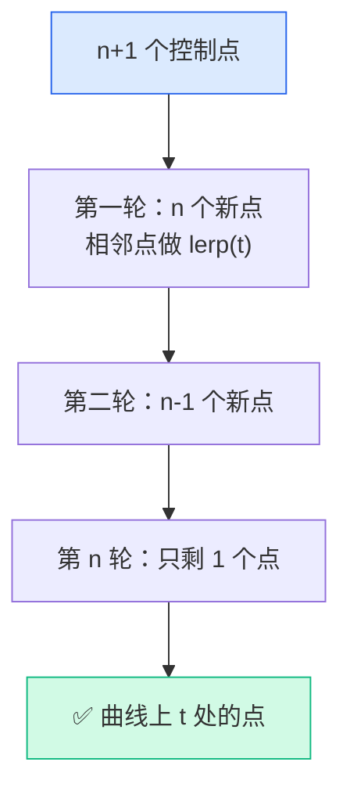
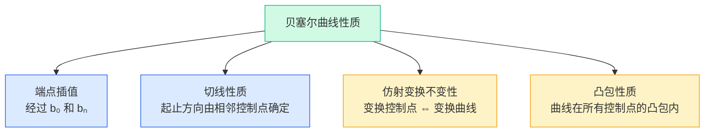
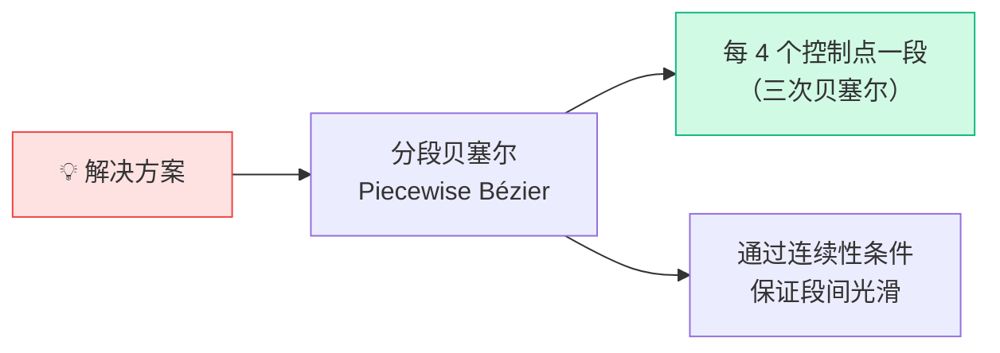
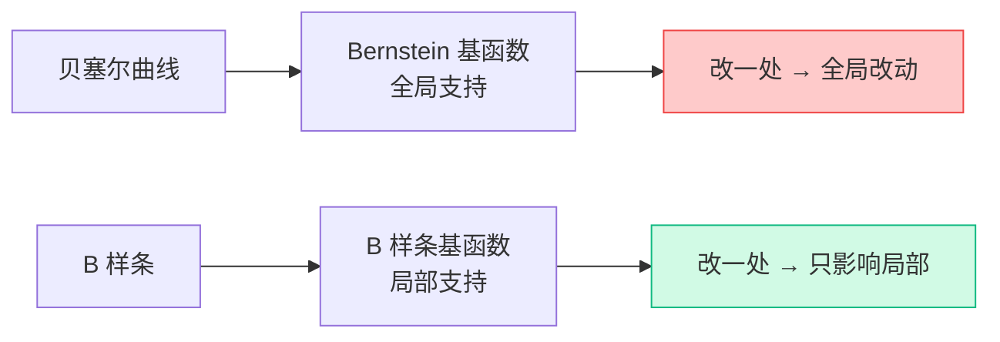
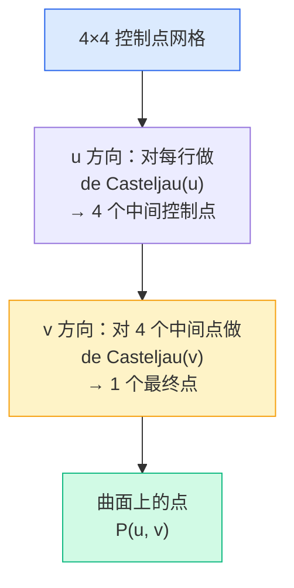

# GAMES101 现代计算机图形学入门 — Lecture 11 学习笔记

## 课程信息

- **课程名称**：GAMES101 现代计算机图形学入门
- **授课教师**：闫令琪（UCSB 助理教授）
- **本节课主题**：Geometry 2 — Curves and Surfaces（几何——曲线与曲面）
- **B站视频**：[Lecture 11 - Geometry 2 (Curves and Surfaces)](https://www.bilibili.com/video/BV1X7411F744?p=11)

---

## 📑 目录

- [零、前情回顾](#零前情回顾从离散网格到连续曲线)
- [1. 贝塞尔曲线：控制点定义曲线](#1-贝塞尔曲线控制点定义曲线)
- [2. de Casteljau 算法](#2-de-casteljau-算法)
- [3. 代数表达：Bernstein 多项式](#3-代数表达bernstein-多项式)
- [4. 贝塞尔曲线的核心性质](#4-贝塞尔曲线的核心性质)
- [5. 分段贝塞尔曲线与连续性](#5-分段贝塞尔曲线与连续性)
- [6. B 样条简介](#6-b-样条简介)
- [7. 贝塞尔曲面](#7-贝塞尔曲面bspline-bézier-surfaces)
- [8. 关键知识点总结](#8-关键知识点总结)

---

## 零、前情回顾：从离散网格到连续曲线

Lecture 10 建立了隐式几何（$f(x,y,z)=0$）和显式几何（坐标/参数映射）两类表示的基础框架。但有一个关键话题留给了本讲：

> 🔑 **上一讲的多边形网格是离散的、分段线性的——由无数个小三角形"近似"出曲面。本讲要解决的问题是：如何用少量控制点定义出光滑、连续、可微的曲线和曲面？**

这就是**贝塞尔曲线（Bézier Curves）**的出场动机——用数学公式描述光滑曲线，而不是用无数个三角形去逼近。

---

## 1. 贝塞尔曲线：控制点定义曲线

### 1.1 动机：用少量点定义光滑曲线

三角形网格需要大量顶点才能表示光滑曲面。而贝塞尔曲线的思路是：**给出少量控制点（Control Points），通过数学公式自动生成一条光滑曲线**。

> 控制点 b₀, b₁, b₂, b₃  →  一条光滑曲线
>
>        b₁
>        ●
>       ╱ ╲
> b₀  ╱    ╲  b₃
>  ●—╱      ╲—●
>      ╲    ╱
>       ╲  ╱
>        ●
>        b₂

### 1.2 基本概念

| 概念 | 说明 |
|------|------|
| **控制点（Control Points）** | 定义曲线形状的空间点，$n+1$ 个控制点 → $n$ 阶贝塞尔曲线 |
| **起始/终止端点** | 曲线必经过第一个控制点 $b_0$ 和最后一个控制点 $b_n$ |
| **中间控制点** | 曲线不一定经过它们，它们"引导"曲线的走向 |
| **起始切线** | 沿 $b_0 \to b_1$ 方向 |
| **终止切线** | 沿 $b_{n-1} \to b_n$ 方向 |

> 📌 贝塞尔曲线是**显式表示**的一种——它用参数 $t$ 映射到曲线上的点，属于「参数映射」类。

---

## 2. de Casteljau 算法

### 2.1 核心思想：递归线性插值

**de Casteljau 算法**是计算贝塞尔曲线上任意点位置的经典算法。它的核心只有两个操作：**线性插值 + 递归**。

> 给定参数 $t \in [0, 1]$，每次在相邻控制点的连线上做 $t$ 比例的线性插值，得到一层新的"中间点"；对中间点重复同样操作，层层递归，直到只剩一个点——这个点就是曲线上参数 $t$ 处的点。

### 2.2 二次贝塞尔（3 个控制点）

> 控制点：$b_0, b_1, b_2$  （$n=2$，二次曲线）
>
> **第一轮**：在相邻线段上取 t 比例处
>
>       b₁                        b₁
>       ●                        ●
>      ╱ ╲                      ╱ ╲
>     ╱   ╲          →         ╱ ● ╲        b¹₀ 在线段 b₀b₁ 上
>    ╱     ╲                  ╱  │  ╲       b¹₁ 在线段 b₁b₂ 上
> b₀●───────●b₂           b₀●──●──●b₂
>                             b¹₀  b¹₁
>
> $b^1_0 = \text{lerp}(t, b_0, b_1) = (1-t) b_0 + t \cdot b_1$
> $b^1_1 = \text{lerp}(t, b_1, b_2) = (1-t) b_1 + t \cdot b_2$
>
> **第二轮**：对新得到的两点再做一次插值
>
> $b^2_0 = \text{lerp}(t, b^1_0, b^1_1) = (1-t) b^1_0 + t \cdot b^1_1$
>
> $b^2_0$ 就是曲线上参数 $t$ 处的点。

### 2.3 三次贝塞尔（4 个控制点）

三次贝塞尔曲线是实践中最重要的贝塞尔形式——Photoshop 的钢笔工具、TrueType 字体、CSS transition 的 cubic-bezier 都是它：

> 控制点：$b_0, b_1, b_2, b_3$  （$n=3$，三次曲线）
>
> **递归层级**：4 个点 →（第一轮）→ 3 个点 →（第二轮）→ 2 个点 →（第三轮）→ 1 个最终点
>
>     b₀●────────●b₁       b²₀       b²₁
>        ╲      ╱            ●───●─●
>      b¹₀●────●b¹₁    →     ╲ ╱
>          ╲  ╱              b³₀●  = 曲线上的点
>      b¹₁  ●          每一轮点数减少 1
>            ╲
>     b₂●─────●b₃

> 💡 **de Casteljau 算法的美妙之处**：它不需要任何微积分——不需要求导、不需要解方程。唯一需要的操作就是「线性插值」，重复足够多次。这使得它在数值上非常稳定，也极易在 GPU 上实现。

遍历 $t$ 从 $0$ 到 $1$，对每个 $t$ 都做一次完整的 de Casteljau 递归，就得到了整条贝塞尔曲线。

---

## 3. 代数表达：Bernstein 多项式

### 3.1 从递归到闭合公式

de Casteljau 算法逐次插值的过程，可以展开为控制点的线性组合。这个组合的系数就是 **Bernstein 多项式**：

$$\boxed{\mathbf{b}^n(t) = \sum_{j=0}^{n} \mathbf{b}_j B_j^n(t)}$$

$$B_j^n(t) = \binom{n}{j} t^j (1-t)^{n-j}$$

其中：

| 符号 | 含义 |
|------|------|
| $n$ | 贝塞尔曲线的阶数（$n+1$ 个控制点 → $n$ 阶曲线） |
| $\mathbf{b}_j$ | 第 $j$ 个控制点的坐标向量 |
| $B_j^n(t)$ | 第 $j$ 个 $n$ 阶 Bernstein 多项式（权重函数） |
| $\binom{n}{j}$ | 二项式系数 = $\frac{n!}{j!(n-j)!}$ |
| $t$ | 参数，$t \in [0, 1]$ |

### 3.2 Bernstein 多项式的直觉

Bernstein 多项式 $B_j^n(t)$ 决定了第 $j$ 个控制点在曲线 $t$ 处的**权重**：

> 当 $t = 0$ 时：$B_0^n(0) = 1$，其他 $B_j^n(0) = 0$ → 曲线经过 $b_0$
> 当 $t = 1$ 时：$B_n^n(1) = 1$，其他 $B_j^n(1) = 0$ → 曲线经过 $b_n$
> 当 $t = 0.5$ 时：所有控制点都有权重，中间的 $j$ 权重最大

> 💡 Bernstein 多项式是一组"partition of unity"——对任意 $t$，所有权重之和恒等于 1。这保证了贝塞尔曲线是所有控制点的**凸组合（Convex Combination）**，这是凸包性质的基础。

### 3.3 三次贝塞尔展开

以最常见的三次贝塞尔曲线（$n=3$）为例，展开公式：

$$\mathbf{b}^3(t) = \mathbf{b}_0(1-t)^3 + \mathbf{b}_1 \cdot 3t(1-t)^2 + \mathbf{b}_2 \cdot 3t^2(1-t) + \mathbf{b}_3 t^3$$

| $j$ | 控制点 | Bernstein 多项式 | 实际形式 |
|:---:|------|------------------|---------|
| 0 | $\mathbf{b}_0$ | $B_0^3(t)$ | $(1-t)^3$ |
| 1 | $\mathbf{b}_1$ | $B_1^3(t)$ | $3t(1-t)^2$ |
| 2 | $\mathbf{b}_2$ | $B_2^3(t)$ | $3t^2(1-t)$ |
| 3 | $\mathbf{b}_3$ | $B_3^3(t)$ | $t^3$ |

> 📌 在三维空间中，每个控制点 $\mathbf{b}_j$ 可以是 $(x_j, y_j, z_j)$，对每个坐标分量分别使用同样的 Bernstein 权重即可。例如 $\mathbf{b}_0 = (0, 2, 3)$，$\mathbf{b}_1 = (2, 3, 5)$，$\mathbf{b}_2 = (6, 7, 9)$，$\mathbf{b}_3 = (3, 4, 5)$。

---

## 4. 贝塞尔曲线的核心性质

### 4.1 端点插值（Endpoint Interpolation）

曲线一定经过第一个和最后一个控制点：

$$\mathbf{b}^n(0) = \mathbf{b}_0 \qquad \mathbf{b}^n(1) = \mathbf{b}_n$$

> 📌 这就是为什么贝塞尔曲线"看起来"从 $b_0$ 画到 $b_n$——不是巧合，而是公式保证的。

### 4.2 切线性质（Tangent）

以三次贝塞尔为例，端点处的切线方向由相邻控制点确定：

$$\mathbf{b}'(0) = 3(\mathbf{b}_1 - \mathbf{b}_0)$$

$$\mathbf{b}'(1) = 3(\mathbf{b}_3 - \mathbf{b}_2)$$

> 💡 这个性质在拼接曲线时至关重要：要保证两段贝塞尔曲线在连接点处光滑过渡，就需要控制切线方向一致（详见第 5 节）。

### 4.3 仿射变换不变性（Affine Transformation Property）

> 🔑 **对贝塞尔曲线的控制点做仿射变换后再画曲线 = 先画曲线，再对曲线上的每个点做同样的仿射变换。**

$$
\text{先变换} \quad \xrightarrow{\text{曲线求值}} \quad \text{与} \quad \text{先曲线求值} \quad \xrightarrow{\text{变换}} \quad \text{等价}
$$

这意味着：
- ✅ 旋转、平移、缩放、错切（Shear）——都适用
- ❌ **投影变换（Perspective Projection）不适用！** 必须在投影前（世界空间或相机空间）对控制点做曲线求值

> ⚠️ 这个性质的实用价值：想要在屏幕上画一条透视投影后的贝塞尔曲线？不能先把控制点投影到屏幕再画——投影会扭曲曲线的形状。正确的做法是先在 3D 空间画曲线，再对曲线本身做投影。

### 4.4 凸包性质（Convex Hull Property）

> 🔑 **曲线上任意一点一定落在所有控制点构成的凸包（Convex Hull）内。**

| 概念 | 直觉理解 |
|------|---------|
| **凸包** | 用橡皮筋把所有控制点套住，自然收缩形成的最小凸多边形 |
| **性质含义** | 曲线不会"飞出"控制点围成的区域 |

> 直观测试：在一张纸上钉几个钉子（=控制点），用橡皮筋套住所有钉子松手，橡皮筋的形状就是凸包。不论 $t$ 怎么取，曲线上的所有点都在这个橡皮筋之内。

**凸包性质的实际用途**：
- 快速判断曲线与某物体可能相交的范围（bounding volume）
- 两个贝塞尔曲线如果各自的凸包不相交，则曲线本身也绝不相交

> 📌 这是一个非常强的几何保证——它的根源是 Bernstein 多项式的"partition of unity"性质（所有权重之和 = 1 且每个权重 ≥ 0）。

---

## 5. 分段贝塞尔曲线与连续性

### 5.1 高阶贝塞尔曲线的病态问题

用 10 个控制点定义一条 9 阶贝塞尔曲线会发生什么？

> ⚠️ **控制点太多时，贝塞尔曲线变得很难控制**——移动一个中间控制点会对整条曲线产生不符合直觉的全局影响。高阶曲线在大范围空间变化中**震荡严重**，不像你想象的样子。

### 5.2 每 4 个控制点定义一段

最常见的方式是**三次贝塞尔（Cubic Bézier）分段拼接**：

> 控制点序列：$b_0, b_1, b_2, b_3 \;|\; b_3, b_4, b_5, b_6 \;|\; b_6, b_7, b_8, b_9 \;|\; \ldots$

这是 Photoshop 钢笔工具、字体轮廓（TrueType/OpenType）、CSS 动画曲线的标准做法。

### 5.3 连续性条件

相邻两段曲线要想"看起来"像一条完整曲线，需要满足特定的连续性条件：

| 连续性 | 条件 | 效果 |
|--------|------|------|
| **C⁰ 连续（位置连续）** | 前一段终点 = 后一段起点 | 不断开，但连接处可能有折角 |
| **C¹ 连续（切线连续）** | C⁰ + 连接点两边的控制点**三点共线且方向相反**、距离相等 | 一阶导数连续，视觉上过渡光滑 |
| **C² 连续（曲率连续）** | C¹ + 二阶导数也连续 | 曲率连续，更高级的光滑度 |

> 图示（三次贝塞尔）：
>
>        a₂（倒数第 2 个控制点）
>          ●
>         ╱ ╲
>        ╱   ╲
>  a₀ ●─────● a₃ = b₀ ●─────● b₃
>     (第一段结束)   (第二段开始)
>
> **C⁰**：a₃ = b₀  ✓（位置相同）
> **C¹**：a₂, a₃(=b₀), b₁ **三点共线 + 方向相反 + a₂→a₃ 距离 = a₃→b₁ 距离**  ✓

> 💡 工业设计中通常要求 C¹ 连续（切线光滑）——车身的反射线（高光线）在接缝处不能断。更高的 C² 连续用于需要连续曲率变化的曲面（如汽车前挡风玻璃）。

---

## 6. B 样条简介

### 6.1 贝塞尔曲线的历史局限

贝塞尔曲线虽然优雅，但有一个**顽固的结构性问题**：

> ⚠️ **改变任意一个控制点 = 整条曲线都会改变**。

Bernstein 多项式 $B_j^n(t)$ 的公式告诉我们：对于固定的 $t$，每个控制点的权重 $B_j^n(t)$ 都不为 0（在 $t \in (0,1)$ 内）。结果就是**没有局部性（Locality）**——调整曲线的任何部分都会影响整条曲线。

### 6.2 B 样条的核心改进

**B 样条（B-splines = Basis Splines）** 是贝塞尔曲线的广义扩展：

| | 贝塞尔曲线 | B 样条 |
|------|----------|-------|
| **基函数** | Bernstein 多项式（全局支持） | B 样条基函数（**局部支持**） |
| **控制点影响力** | 全局——改一个点影响整条曲线 | **局部——改一个点只影响相邻几段** |
| **连续性** | 自动保证曲率连续（内部） | 可在节点处精确控制连续性级别 |
| **复杂度** | 简单——每段曲线 $n+1$ 个控制点 | 更复杂——节点向量、基函数定义 |

> 📌 本课对 B 样条的介绍较为简要，重点在于理解 B 样条解决了贝塞尔的「全局修改」病态。更详细的 B 样条理论和 NURBS（Non-Uniform Rational B-Splines）在高级建模课程中会进一步展开。

---

## 7. 贝塞尔曲面（Bézier Surfaces）

### 7.1 从曲线到曲面：加法 vs 乘法

一维贝塞尔曲线有一个参数 $t$：给 $t$ → 得曲线上一个点。要定义曲面，需要**两个参数** $(u, v)$：给 $(u, v)$ → 得曲面上一个点。

> 🔑 **贝塞尔曲面 = 两个方向的贝塞尔曲线"张成"的曲面（Tensor Product）。**

### 7.2 4×4 控制点的双三次贝塞尔曲面片

以最常见的 4×4 控制点网格（Bicubic Bézier Surface Patch）为例：

>            v ↑
>              │
>     b₀₃ ●───●───●───● b₃₃
>         │   │   │   │
>     b₀₂ ●───●───●───● b₃₂
>         │   │   │   │
>     b₀₁ ●───●───●───● b₃₁
>         │   │   │   │
>     b₀₀ ●───●───●───● b₃₀
>              └──────────→ u
>
>     4×4 = 16 个控制点定义一张曲面片

### 7.3 可分离的 1D de Casteljau 算法

给定参数 $(u, v)$，如何求曲面上的点？思路：**先做 u 方向的曲线，再在 v 方向合并**。

> **Step 1**：对 u 方向的每行（4 行），用参数 $u$ 对 4 个控制点做一次 de Casteljau 求值
>
> 得到 4 个"移动"控制点（每行产生一个点）：
>
>        ●   ●   ●   ●    这个新产生的四个点在 v 方向上排列
>
> **Step 2**：对这个 4 个新控制点，在 v 方向上用参数 $v$ 再做一次 de Casteljau 求值
>
> 得到最终曲面上的点

> 💡 **可分离性（Separability）** 是贝塞尔曲面最大的工程优势。不需要为 2D 曲面专门写一个二维 de Casteljau——直接复用 1D de Casteljau 两次（u 方向一次、v 方向一次）就完事。

遍历所有 $u, v \in [0, 1]$，就得到了整张贝塞尔曲面片。对于更复杂的曲面，可以用多个曲面片拼接（类似于分段贝塞尔曲线的思想），通过边界上的连续性条件保证光滑。

---

## 8. 关键知识点总结

| # | 知识点 | 核心要点 |
|---|--------|---------|
| 1 | **贝塞尔曲线定义** | $n+1$ 个控制点 → $n$ 阶曲线；曲线必经过 $b_0$ 和 $b_n$ |
| 2 | **de Casteljau 算法** | 递归线性插值：每轮点数减 1，n 轮后只剩 1 个点 → 曲线上的点；只需要 lerp |
| 3 | **Bernstein 多项式** | $\mathbf{b}^n(t) = \sum \mathbf{b}_j B_j^n(t)$，$B_j^n(t) = \binom{n}{j} t^j (1-t)^{n-j}$ |
| 4 | **端点插值** | $t=0$ 时经过 $b_0$，$t=1$ 时经过 $b_n$；中间控制点不被遍历 |
| 5 | **切线性质** | 三次贝塞尔：$\mathbf{b}'(0) = 3(b_1 - b_0)$，$\mathbf{b}'(1) = 3(b_3 - b_2)$ |
| 6 | **仿射不变性** | 先变换控制点再求值 ⇔ 先求值再变换点；**投影变换不适用** |
| 7 | **凸包性质** | 曲线上任意点都在控制点凸包内；Bernstein 多项式权重大于零且和为 1 的结果 |
| 8 | **分段贝塞尔** | 固定每段 4 个控制点（三次），拼接多段以避免高阶"失控" |
| 9 | **C⁰ / C¹ 连续** | C⁰ = 前段终点 = 后段起点；C¹ = 交点两侧的控制点三点共线 + 方向相反 + 距离相等 |
| 10 | **B 样条** | 基函数有局部支持——改一个控制点只影响局部几段，解决贝塞尔的全局修改病态 |
| 11 | **贝塞尔曲面** | 可分离的二维 de Casteljau：先 u 方向求值 → 再 v 方向求值；两个 1D 算法复用即可 |

---

## 🎬 课程视频

- **B站链接**：[Lecture 11 - Geometry 2 (Curves and Surfaces)](https://www.bilibili.com/video/BV1X7411F744?p=11)

<iframe src="//player.bilibili.com/player.html?bvid=BV1X7411F744&p=11"
        scrolling="no"
        border="0"
        frameborder="no"
        framespacing="0"
        allowfullscreen="true"
        width="100%"
        height="500">
</iframe>

---

**参考资料**：
- GAMES101 Lecture 11 课程视频及课件
- 闫令琪老师课程网站 http://www.cs.ucsb.edu/~lingqi/teaching/games101.html
- Farin, Gerald — *Curves and Surfaces for CAGD: A Practical Guide*
- Salomon, David — *Curves and Surfaces for Computer Graphics*
